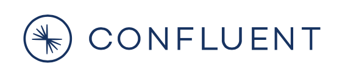
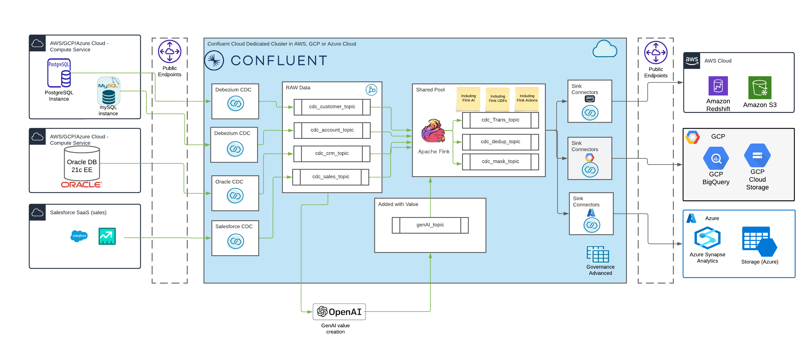

# Confluent ATG CDC-Hands-on-Workshop

Change Data Capture (CDC) is a crucial use case for Apache Kafka and Confluent because it enables real-time data synchronization and integration across diverse systems, ensuring that any changes in a database are immediately captured and propagated to other systems. This capability is particularly important for several reasons:

1. **Real-time Data Streaming**: CDC allows businesses to capture changes in their databases and stream them in real time to Kafka. This is essential for applications that require up-to-date information, such as real-time analytics, monitoring, or responsive user experiences.

2. **Microservices Architecture**: In microservices architectures, different services often rely on the same underlying data but need to remain decoupled. CDC allows these services to stay updated with the latest data changes without directly querying the database, improving efficiency and scalability.

3. **Data Integration**: CDC is a key technology for integrating data from multiple sources into a centralized system, such as a data warehouse or data lake, without interrupting ongoing operations. This is crucial for maintaining data consistency and enabling comprehensive data analytics.

4. **Legacy System Modernization**: CDC helps companies modernize legacy systems by allowing them to stream data from older databases into newer, more scalable systems without disrupting existing workflows.

5. **Event-driven Architectures**: CDC supports the implementation of event-driven architectures, where changes in data automatically trigger events that other systems can respond to. This is fundamental for creating reactive systems that can automatically adapt to new information.

Because of these benefits, CDC is considered one of the top use cases for Apache Kafka and Confluent, as it leverages Kafka's ability to handle high-throughput, low-latency data streams and integrates well with Confluent's ecosystem of tools for building robust, scalable data pipelines.

We have developed a CDC workshop designed as a modular system. The workshop exclusively uses cloud services, and we operate in either AWS, GCP, or Azure Cloud. Each participant can choose their own cloud environment, can choose their own components to use and build a personal realistic setup for his/her use case. In the workshop, we work with the following sources:

* Oracle 21c DB,
* PostgreSQL,
* MySQL,
* and Salesforce.

And with the following sinks:

* AWS: S3, Redshift
* GCP: GCP Storage, BigQuery
* Azure: Azure Storage, Azure Synapse Analytics 

> [!NOTE]
> Everyone is invited to add a new component (cloud service), which can easily deployed with terraform.

We exclusively use Confluent Cloud Fully-Managed Source CDC Connectors for integration. The data is processed, enriched, and prepared in a Confluent cluster using Flink SQL, and we also leverage generative AI from OpenAI for this purpose. The processed information is then made available to the respective cloud services (Storage, DWH) in AWS, GCP, or Azure. For this, we also use Fully-Managed Sink Connectors in Confluent Cloud.

> [!NOTE]
> The deployment of architectural components is carried out exclusively with Terraform. So this does mean terraform has to be installed and ready to use. I am running version 1.6.6,
> Follow the official instruction to install terraform: see [Hashicorp Documentation](https://developer.hashicorp.com/terraform/install).

Each participant can integrate their own systems using suitable connectors, making the modular system flexibly extendable.

The following architecture provides an overview of all the components we build and use in the workshop. However, as mentioned, each participant operates in only one cloud environment—either AWS, GCP, or Azure.



## Use cases

To be honest, I haven't prepared a specific use case. It's more about the fact that with the sources and sinks, almost anything can be implemented. This ranges from the aforementioned 5 reasons for CDC to Master Data Management (MDM), Product Information Management (PIM), and Customer 360. A bit of everything has been implemented in this workshop. Just let yourselves be surprised. 
However, **you are all invited to contribute your own ideas**.

## Prerequisite

* [install](https://developer.hashicorp.com/terraform/tutorials/aws-get-started/install-cli) terraform (my version v.1.6)
* You will find additional information for preparation in the relevant guides for the respective cloud providers ([**AWS**](terraform/aws/README.md),[**GCP**](terraform/gcp/README.md), [**Azure**](terraform/azure/README.md)).
* Next action is: clone the github repo onto you Desktop:

```bash
git clone https://github.com/ora0600/confluent-cdc-workshop.git
```

## Let the Hands-on Start

The hands-on workshop is prepared with a step-by-step guide for the following cloud providers:

* [**AWS**](terraform/aws/README.md): Start here if AWS is your first choice
* [**GCP**](terraform/gcp/README.md): Start here if GCP is your first choice
* [**Azure**](terraform/azure/README.md): Start here if Azure is your first choice

The architecture may seem complex at first, but the workshop is very well-prepared and easy to follow.

## Feature List

In the workshop we will use and show several features

* Easy deployment with Terraform  
* Easy integration with fully-managed Source CDC connectors
* Easy integration with fully-managed Sink connectors
* Schema Registry for ensuring data compatibility and consistency across systems (Focus AVRO Format)
* Cloud Services protected with MY-IP and Confluent Cloud Egress IPs Access only
* Service Account and Role management
* Confluent Cloud data portal for exploring data products and tagging data products
* stream processing for transformation, enrichment, masking, De-duplication (Flink Actions) and others
* Stream Lineage for data pipeline visualization

## License

No licenses are required for this workshop.

* For the **Oracle DB**, we use the [OTN License](https://www.oracle.com/downloads/licenses/standard-license.html).
* For **Salesforce**, we use a Developer Account which is free of charge.
* We need a cloud account with an appropriate subscription (**AWS, GCP, or Azure**). The costs for this are minimal, as we use storage services, DWH services, and compute services for a few hours. You can try to get a free account with a small budget ([Aws Free Tier Account](https://aws.amazon.com/free/), [GCP Free Account](https://cloud.google.com/free/), [Azure Free Account](https://azure.microsoft.com/en-us/pricing/purchase-options/azure-account?icid=azurefreeaccount)). But please be aware that Free Account does not mean, everything is for free. It is the case that e.g. our Compute shapes in this workshop do not belong to free tier because the shape is not included.
* A subscription is also required for **Confluent Cloud**, though a demo account can be used. Confluent offers $400 for free. This is more than enough for our workshop. [Confluent Cloud Free Account](https://www.confluent.io/confluent-cloud/tryfree/)
* **PostgreSQL and MySQL** are used as open-source components.