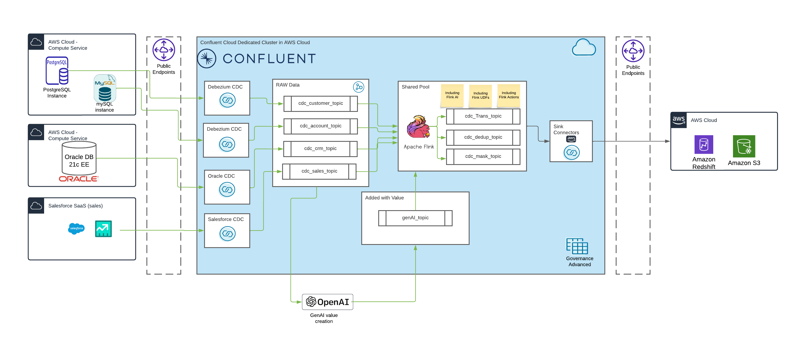
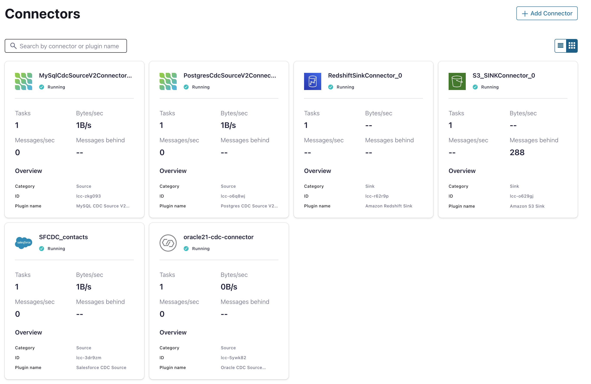
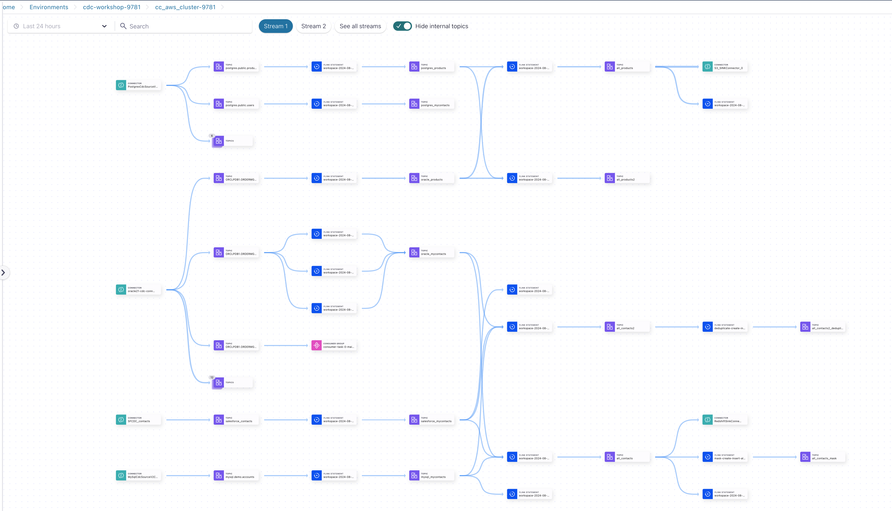
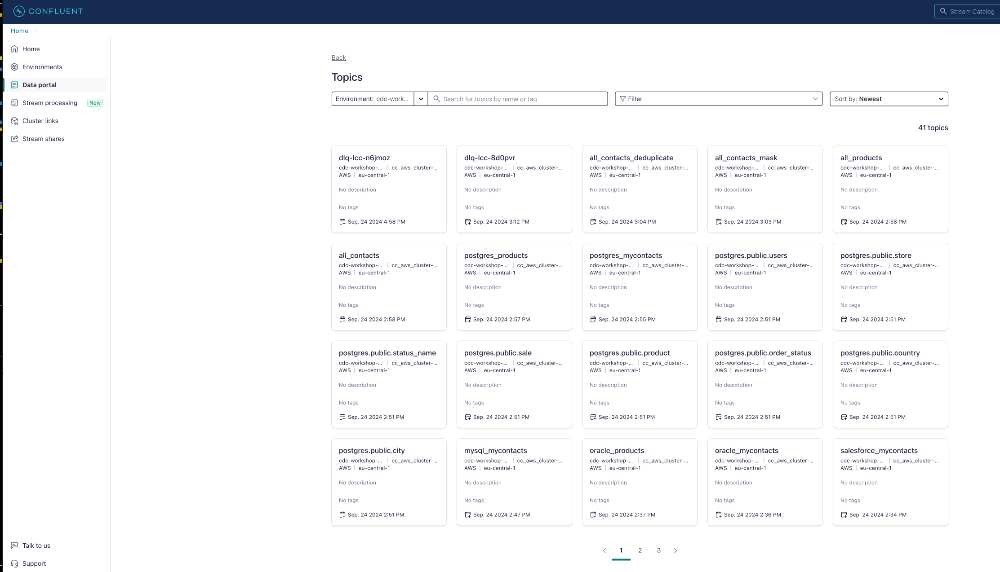

# Confluent ATG CDC-Hands-on-Workshop (AWS deployment)

You have chosen AWS. We will conduct the entire workshop exclusively using AWS services.



# Content

[1. Prerequisite](README.md#Prerequisite)

[2. Start your Deployment](README.md#Start-your-Deployment)

[3. Destroy Deployment Cloud Services for Hands-on](README.md#Destroy-Deployment-Cloud-Services-for-Hands-on)

## Prerequisite

> [!CAUTION]
> The workshop was tested with MacBook Pro on Intel.

The preparations are very important and need your attention.

* Confluent Cloud account([Sign-up](https://www.confluent.io/confluent-cloud/tryfree/)) and [Confluent Cloud API Key](https://www.confluent.io/blog/confluent-terraform-provider-intro/#api-key)
* AWS account ([Sign-up](https://aws.amazon.com/free/)) and [Create an AWS IAM User Access Key](https://docs.aws.amazon.com/IAM/latest/UserGuide/id_credentials_access-keys.html).  And finally create a [key pair](https://docs.aws.amazon.com/AWSEC2/latest/UserGuide/create-key-pairs.html) for your Amazon EC2 instance
* Salesforce account and configuration for using CDC. Create a Salesforce Developer account [Sign-up](https://developer.salesforce.com/signup). Configure Salesforce CDC, follow [my setup with screenshots](ccloud-source-salesforce-cdc-connector/setup_salesforce.md) or use [Confluent Documentation](https://docs.confluent.io/cloud/current/connectors/cc-salesforce-source-cdc.html#quick-start)
* (optional) openAI Account ([Sign-up](https://platform.openai.com/signup/)) and [API Key](https://platform.openai.com/docs/quickstart/create-and-export-an-api-key), we need this to produce product data
* I will use `export myip=$(dig +short myip.opendns.com @resolver1.opendns.com)` in [00_create_client.properties.sh](ccloud-cluster/00_create_client.properties.sh), please check if this command is working for you. If not set export myip=X.X.X.X manually to your public IP.

create a file for all your credentials used in this workshop and store it in `terraform/aws/.accounts`:

```bash
cd confluent-cdc-workshop/terraform/aws/
echo "# Confluent Cloud
export TF_VAR_confluent_cloud_api_key=\"KEY\"
export TF_VAR_confluent_cloud_api_secret=\"SECRET\"
export TF_VAR_cloud_provider=\"AWS\"
export TF_VAR_cc_cloud_region=\"eu-central-1\"
export TF_VAR_cc_env_name=\"cdc-workshop\"
export TF_VAR_cc_cluster_name=\"cc_aws_cluster\"
export TF_VAR_sr_package=\"ADVANCED\"
# AWS Cloud
export aws_access_key=\"KEY\"
export aws_secret_key=\"SECRET\"
export aws_region=\"eu-central-1\"
export ssh_key_name=\"cmawskeycdcworkshop\"
export owner_email=\"Your Email, will be tagged to compute\"
export bucket_name=\"cdc-workshop\"
# Salesforce
export sf_user=\"YOUR EMAIL\"
export sf_password=\"YOUR PW\"
export sf_password_token=\"YOUR TOKEN\"
export sf_consumer_key=\"YOUR CONSUMER KEY\"
export sf_consumer_secret=\"YOUR CONSUMER SECRET\"
export sf_cdc_name=\"ContactChangeEvent\"
# openAI
export OPENAI_API_KEY=\"sk-YOURKEY\"" > .accounts
```

**Parameter description:**
* TF_VAR_confluent_cloud_api_key: Confluent Cloud Cloud Key (I run it as OrgAdmin)
* TF_VAR_confluent_cloud_api_secret: Confluent Cloud Cloud KeySecret
* TF_VAR_cloud_provider: Cloud Provider here AWS
* TF_VAR_cc_cloud_region: Cloud Provider region here eu-central-1
* TF_VAR_cc_env_name: Name of the environment in Confluent Cloud
* TF_VAR_cc_cluster_name: Name of the Confluent Cloud Cluster
* TF_VAR_sr_package: We will use the Advanced Governance package, value is "ADVANCED"
* aws_access_key: AWS User Key
* aws_secret_key: AWS User Key secret
* aws_region: Region in AWS should be same like TF_VAR_cc_cloud_region, but is not enforced could also another region
* ssh_key_name: Name of the compute ssh key, we will use. AWS owns the public key and you need the private key, create it before AWS deployment
* owner_email: Every AWS Resource will get a tag owner_email with email you mentioned here
* bucket_name: S3 bucket name
* sf_user: Your Salesforce user
* sf_password: Your Salesforce password
* sf_password_token: Your Salesforce Password token
* sf_consumer_key: Your CONSUMER Key
* sf_consumer_secret: YOUR CONSUMER SECRET
* sf_cdc_name: ContactChangeEvent if for the CDC Object Contacts.
* (optional) OPENAI_API_KEY: Your openAI API Key

If the `.accounts` file is ready, then preparation is finished. Now everything is more or less easy to execute. We will use terraform only.

## 1. Start your Deployment

How to deploy the cloud resources:

1. Start with Confluent Cluster deployment:
   Please follow this [guide](ccloud-cluster/README.md). Use the Confluent cloud Console, to check what was deployed.
2. Deploy the Oracle 21c DB service in AWS Compute
   Please follow this [guide](oraclexe21c/README.md). The service need a while to get up and running.
3. Deploy all Oracle CDC Source Connector
   Please follow this [guide](ccloud-source-oracle-cdc-connector/README.md). The creation of the Oracle CDC Connector takes a couple of minutes. Please check in Confluent Cloud Console the status.
4. Deploy the other DB services in AWS (mysql and postgreSQL)
   Please follow the instruction in this [guide](mysql_postgres/Readme.md).
5. Deploy mysql CDC Source Connector
   Follow the instructions in [guide](ccloud-source-mysql-cdc-connector/README.md)
6. Deploy postgreSQL CDC Source Connector
   Follow the instructions in [guide](ccloud-source-postgresql-cdc-connector/README.md)
7. Deploy Salesforce CDC Source Connectors
   SalesForce CDC Connector Deployment instructions are find [here](ccloud-source-salesforce-cdc-connector/README.md)
8. Data processing with Flink SQL
   This is the main part of the Hands-on Workshop. We will transform, mask and more within the data processing part. Instruction Guide is [here](dataprocessingREADME.md).
9. Sink new data to Sink services with deployed Sink Connectors (S3, Redshift). We will start with S3. Follow [S3 Sink Connector setup](ccloud-sink-s3-connector/README.md). 
10. Then the setup for [Redshift Sink Connector](ccloud-sink-redshift-connector/README.md).
11. (Optional): Do advanced stuff: Let the data flow by implementing database record generation, follow this [guide](advanced_recordgeneration.md)
12. (optional): Migrate Connectors, this is very important to move self-managed connectors to fully-managed connectors, and also for replay. follow this [guide](connector_migration.md)

If you did implement all components then we run 6 Connectors (4 Source, 2 Sink)


All Labs are implemented. In Confluent **Stream Lineage** we see now what is happening in our cluster and how the data is flowing. Filter by hours


If you would like to check now our data products, please click on the Data Portal and choose the correct environment **cdc-workshop-xxx**. Then you see all the products we did implement.


## Destroy Deployment Cloud Services for Hands-on

Destroy each component step by step:

```bash
cd confluent-cdc-workshop/terraform/aws
bash ./00_shutdown_services.sh
```

Please check in AWS console and Confluent Cloud Console if all services are really deleted. Do not forget, Cloud costs money. If you left a service running, it will generate costs.
If some components are not deleted by terraform, delete it please manually or run again `terraform destroy` for this component.

Good job. The **Hands-on Workshop within AWS is FINISHED**.

Back to [Main-Overview Page](../../README.md)
