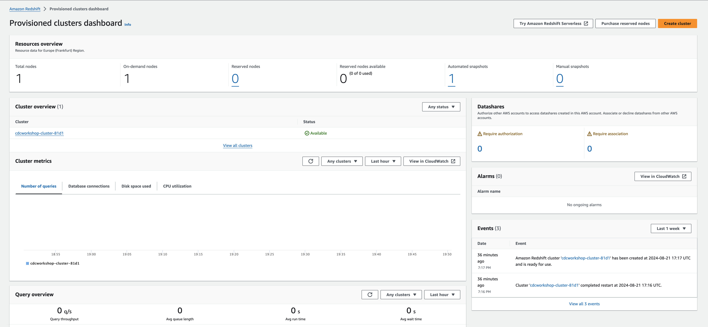

# Deploy AWS Redshift via terraform

This lab is ***optional***.

Deploy the AWS Redshift cluster:

```bash
cd ../aws-redshift
source .aws_env
terraform init 
terraform plan
terraform apply
``` 

If you did deploy successfully with terraform you will get the following output:

```bash
# Apply complete! Resources: 2 added, 0 changed, 0 destroyed.
# Outputs:
# redshift_cluster_details = <sensitive>
# redshift_cluster_dns = "cdcworkshop-cluster-81d1.cokweyivzuty.eu-central-1.redshift.amazonaws.com"
```

to see the complete sensitive data output from terraform do:

```bash
terraform output redshift_cluster_details
```

Redshift Cluster is deployed



back to [Deployment-Steps Overview](../README.md) or continue with the [Redshift Sink Connector](../ccloud-sink-redshift-connector/README.md)
