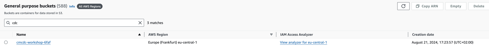

# Deploy S3 bucket

Deploy the S3 Bucket via:

```bash
cd aws-s3
source .aws_env
terraform init 
terraform plan
terraform apply
``` 

If you did deploy successfully with terraform you will get the following output:

```bash
# Apply complete! Resources: 3 added, 0 changed, 0 destroyed.
# Outputs:
# A00_bucket_details = {
#  "acceleration_status" = ""
#  "acl" = tostring(null)
#  "arn" = "arn:aws:s3:::cmcdc-workshop-6faf"
#  "bucket" = "cmcdc-workshop-6faf"
# .......
#}
#A02_bucket_name = "cmcdc-workshop-6faf"
```

You can check in your aws console, if bucket exists:

* Bucket_name: cmcdc-workshop-XXX
* Aws Region: eu-central-1 (Frankfurt)




back to [Deployment-Steps Overview](../README.md) or continue with the [S3 Sink Connector](../ccloud-sink-s3-connector/README.md)