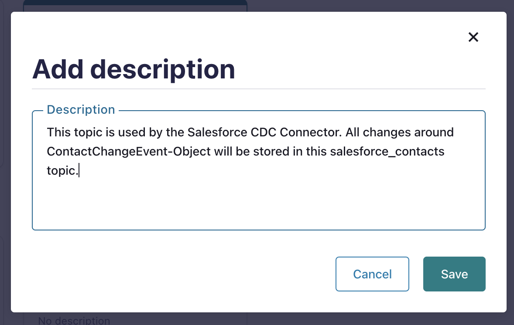

# Confluent Cloud Cluster Deployment

The central component of our workshop is a Kafka cluster. We use Confluent Cloud and deploy everything we need with terraform.

# Content

[1. Why Confluent Cloud?](README.md#Why-Confluent-Cloud?)

[2. Prerequisites for this Confluent Cloud deployment](README.md#Prerequisites-for-this-Confluent-Cloud-deployment)

[3. Deployment with terraform](README.md#Deployment-with-terraform)

[4. Confluent Cloud Cluster](README.md#Confluent-Cloud-Cluster)

## Why Confluent Cloud?

Confluent Cloud offers a fully managed, scalable, and secure Apache Kafka service, allowing you to focus on building applications without worrying about infrastructure management. It provides enterprise-grade features like real-time monitoring, built-in connectors, and advanced security controls, ensuring reliable data streaming at scale. Additionally, Confluent Cloud integrates seamlessly with a wide range of cloud services, making it ideal for modern, cloud-native architectures. All of them we will use in the workshop.

## Prerequisites for this Confluent Cloud deployment

* Having an Confluent Cloud Account, with Key and Secret
* terraform installed (I am running v.1.6.6)
* `.accounts` file is updated with correct credentials and settings.

## Deployment with terraform

Deploy the cluster with terraform and get the following output:

```bash
cd terraform/aws/ccloud-cluster
# Source environment variables
source ../.accounts
# execute terraform
terraform init 
terraform plan
terraform apply
# terraform output:
# Apply complete! Resources: 56 added, 0 changed, 0 destroyed.
# Outputs:
# A01_cc_cdc_env = "env-ID"
# A02_cc_cdc_sr = {
#  "cloud" = "AWS"
#  "id" = "sgID"
#  "package" = "ADVANCED"
#  "region" = "eu-central-1"
#}
#A03_cc_sr_cluster = "lsrc-ID"
#A04_cc_sr_cluster_endpoint = "https://ID.eu-central-1.aws.confluent.cloud"
#A05_cc_kafka_cluster = "lkc-ID"
#A06_cc_kafka_cluster_bootsrap = "SASL_SSL://ID.eu-central-1.aws.confluent.cloud:9092"
#D_01_SRKey = "SRKEY
#D_02_SRSecret = <sensitive>
#D_03_AppManagerKey = "APPMANAGERKEY"
#D_04_AppManagerSecret = <sensitive>
#D_05_ClientKey = "CLIENTKEY"
#D_06_ClientSecret = <sensitive>
#D_07_FlinkKey = "FLINKKEY"
#D_08_FlinkSecret = <sensitive>
#D_09_ConnectorSA = "sa-ID"
#D_10_ConnectorSAKey = "CONNECTORSAKEY"
#D_11_ConnectorSASecret = <sensitive>
#ip_addresses = tolist([
#  {
#    "address_type" = "EGRESS"
#    ...
```

> [!TIP]
> All the keys are important if you would like to create own clients. E.g. testing the End-to-End Client Encryption or play with own clients-

The deployment via terraform generates the variable values for all subsequent services, particularly the DB compute services, which are stored in the `.aws_env` and `.ccloud_env` files.

* for Oracle 21c DB Compute services with egress allowed cidr range and all variables we need to create the service. Execute `cat ../oracle21c/.aws_env`.
* for mysql and PosterGreSQL DB compute Service with egress allowed cidr range and all variables we need to create the service. Execute `cat ../mysql_postgres/.aws_env`.
* for S3 service setup `cat ../aws-s3/.aws_env`
* for Redshift service setup `cat ../aws-redshift/.aws_env`
* for Salesforce connector setup `cat ../ccloud-source-salesforce-cdc-connector/.ccloud_env`

## Confluent Cloud Cluster

If your deployment was successfully build, you will have now:

* An environment (in my case cdc-workshop-xxx) with Schema registry and advanced Governance Pack activated
* Confluent Cloud Cluster Type: BASIC, within the chosen region (in my case, eu-central-1) and cloud provider (in my case, AWS).
* Topics with AVRO schema format
* Service Accounts with Role Bindings (App-Manager (EnvironmentAdmin, FlinkDeveloper, FlinkAdmin, Assigner), SR(EnvironmentAdmin), Clients(CloudClusterAdmin), Connectors(CloudClusterAdmin))
* API Keys for the Service accounts
* Flink SQL Pool with two statements deployed


Please have a look on the data portal. You will see two products

* **salesforce_contacts**: this topic was created by terraform and will be used by the Salesforce CDC Connector
* **salesforce_myleads**: Was created via a `CREATE TABLE Flink Statement` deployed via terraform.


What you can do right now is to document your data products by adding tags and descriptions. Click on `salesforce_contacts` and add a **description**.


You will see that this topic has already a PII Tag, because of the fact that is contains personal data. What we can do right now, is to add business metadata to describe a little bit more who is owner etc. Click on **Add business metadata**. Click **Yes, create now** and create a structure and then click **Create**. (Normally you do so at the beginning of your products, so to say to have your business metadata structure ready.)


Now, go back to the data portal, filter for your environment and click on `salesforce_contacts`. You can add now your business metadata in above structure and have a pretty documented data products.


The advantage of this tagging-documentation is pretty obviously. In a huge data streaming platform or data mesh you will never loose the control.
E.g. a case would be to see/know all products related to salesforce. For this you can search via **business metadata** and will get what you search for. Click on `view all` then add your filter.


back to [Deployment-Steps Overview](../README.md) or [Oracle DB Service guide](../oraclexe21c/README.md)