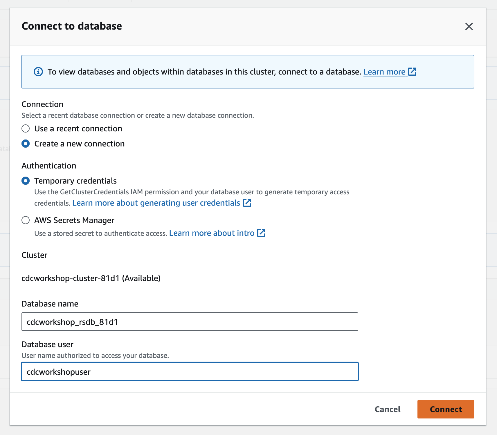
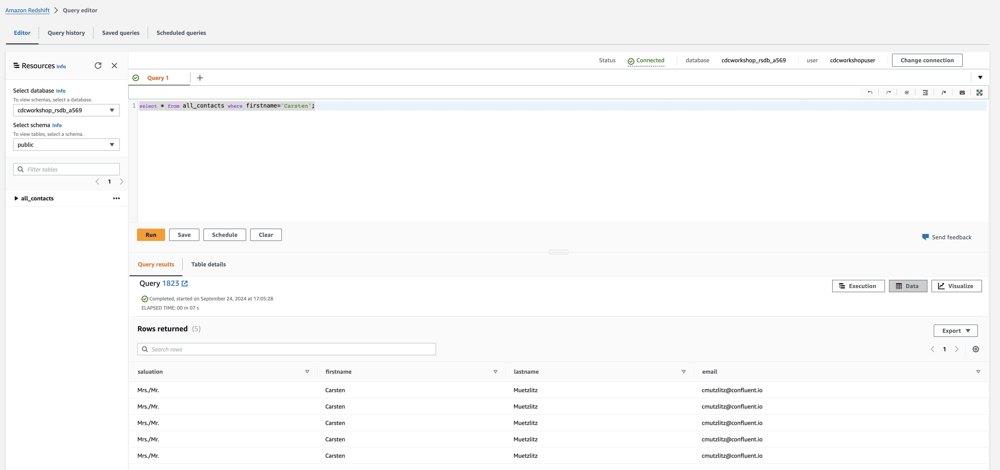

# Deploy AWS Redshift Redshift Connector

The connector configuration requires a Redshift user (and password) with Redshift database privileges. For example:

* AWS Redshift Domain
* AWS Redshift Port
* Connection User
* Connection Password
* Database name

> [!IMPORTANT]
> Permission need to be applied for this user, in my case I run with AmazonRedshiftFullAccess, but this only for demo cases acceptable. Please ask your IAM Admin.

Deploy the Redshift Sink Connector

```bash
# Deploy connector
cd ../ccloud-sink-redshift-connector
source .ccloud_env
terraform init
terraform plan
terraform apply
```

Terraform will output after deployment:

```bash
#Apply complete! Resources: 1 added, 0 changed, 0 destroyed.
#Outputs:
#A00_REDSHIFT_SINK_Connector = "Login into your Confluent Cloud Console and check in your cluster if Redshift Sink Connector is running"
```


We will sink `all_contacts` to Redshift. But you can choose another topic if you want. E.g. take the topic without duplicates. Change topics parameter in `cflt_connectors.tf`.

Default offset setting is `Jump back to the earliest message per topic (default)` but you can start where you want. See [manage offset for Sink Connectors](https://docs.confluent.io/cloud/current/connectors/offsets.html?ajs_aid=5ed44563-a71c-44cb-86d1-9ea6632b3d06&ajs_uid=55951#custom-offsets-sink-proc).

Try to insert a new product:
```bash
ssh -i ~/keys/cmawskeycdcworkshop.pem ec2-user@x.x.x.x
# Insert new contact
docker exec mysql mysql -umysqluser -pmysqlpw demo -e "INSERT INTO accounts (account_id, first_name, last_name, email, phone, address, country)
VALUES ('a011', 'Lisa-Marie', 'Presley', 'lisa@presley.com', '+01343433', 'New York', 'USA');"
# Just ignore it
# check if inserted
docker exec mysql mysql -umysqluser -pmysqlpw demo -e "select * from accounts;"
exit
```

Before you see the data in Redshift you need to connect to a database. Go into the cluster console, and connect to a database.
Cluster is given: e.g.  cdcworkshop-cluster-a569
Database name would be: cdcworkshop_rsdb_a569 (**Attention: now with underscore**)
Database user is:       cdcworkshopuser


Under Database Objects - Tables and views you see now our all_contacts table, which was created automatically by our Sink Redshift Connector.


Query the database by open the Editor:

```sql
select * from all_contacts where firstname='Carsten';
````

Run the query and you will see all the duplicates.


Fortunately, we have already performed deduplication on the `all_contacts` topic. Fixing duplicates in Redshift would be complex and incur additional costs for data transfer. Therefore, it is more efficient to load only the unique data into Redshift. A potential solution would be to run the connector with the `all_contacts_deduplicate` topic, but this step is optional.

Everything is implemented. You are finished right now. Do not forget to delete everything. At [Deployment-Steps Overview](../README.md#destroy-deployment-cloud-services-for-hands-on) you have a complete script to delete everything.

back to [Deployment-Steps Overview](../README.md)
