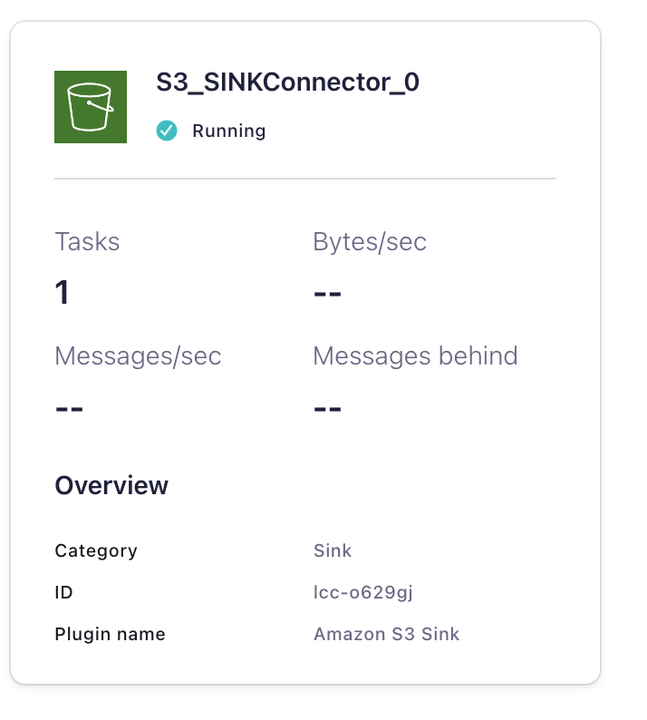
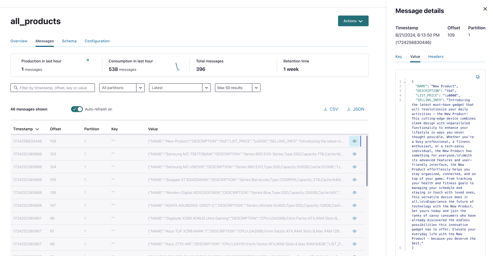
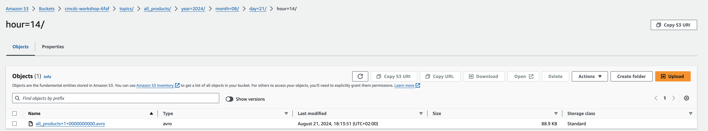

# Deploy S3 Sink Connector

Deploy the S3 Sink Connector

```bash
# Deploy connector
cd aws/ccloud-sink-s3-connector
source .ccloud_env
terraform init
terraform plan
terraform apply
```

Terraform will output after deployment:

```bash
# Apply complete! Resources: 1 added, 0 changed, 0 destroyed.
# Outputs:
# A00_S3_SINK_Connector = "Login into your Confluent Cloud Console and check in your cluster if S3 Sink Connector is running"
```



We will sink `all_products` to S3.

Default offset setting is `Jump back to the earliest message per topic (default)` but you can start where you want. See [manage offset for Sink Connectors](https://docs.confluent.io/cloud/current/connectors/offsets.html?ajs_aid=5ed44563-a71c-44cb-86d1-9ea6632b3d06&ajs_uid=55951#custom-offsets-sink-proc).

After S3 Connector deployment you will see no data in S3.

Try to insert a new product:
```bash
ssh -i ~/keys/cmawskeycdcworkshop.pem ec2-user@x.x.x.x
# INSERT
$ docker exec -it postgres psql -U postgres-user -d customers
customers=# select * from product;
# product_id |    name     
#------------+-------------
#          1 | Product 1
# ...
#         100| Product 100
customers=# INSERT INTO PRODUCT VALUES (101, 'New Product');
# INSERT 0 1
customers-# \q
$ exit
```

New product is flowing into `all_products` topic:


But still nothing visible in S3. It takes a while and you will see the avro file.


back to [Deployment-Steps Overview](../README.MD) or continue with Sink Cloud Services [Redshift](aws-redshift/README.md)