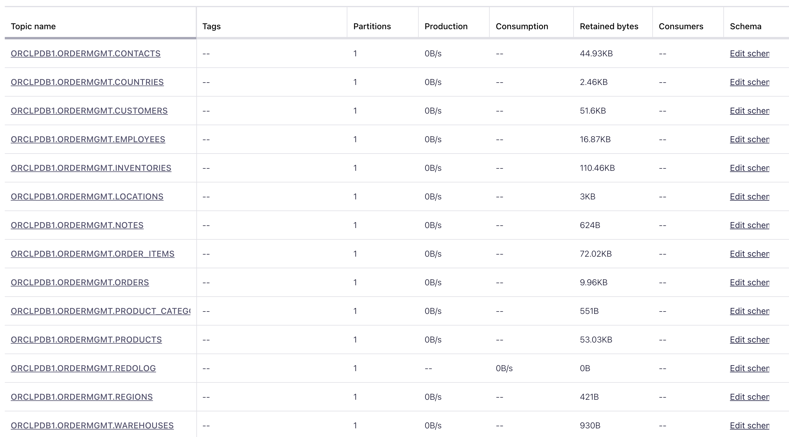
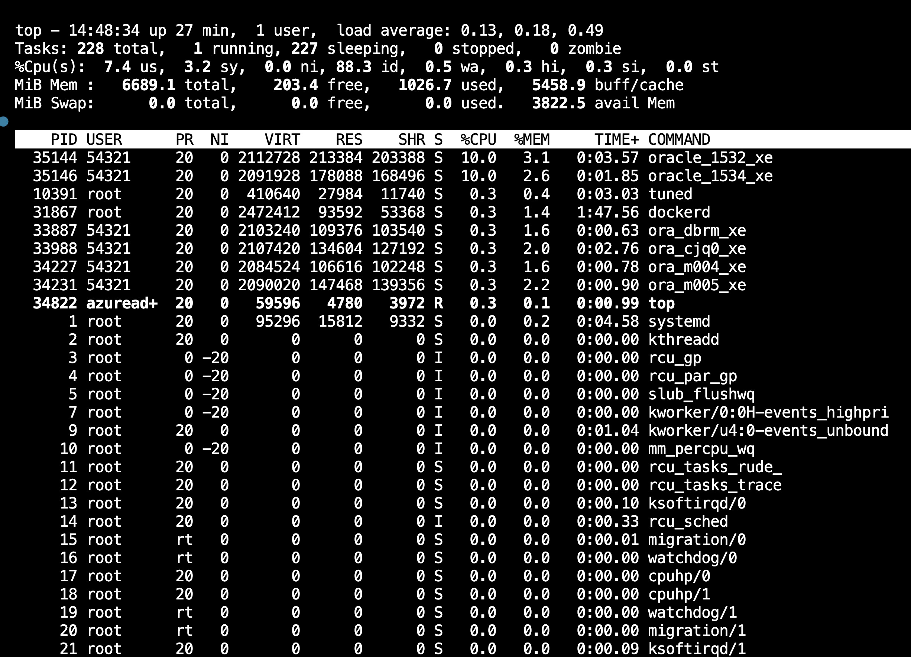
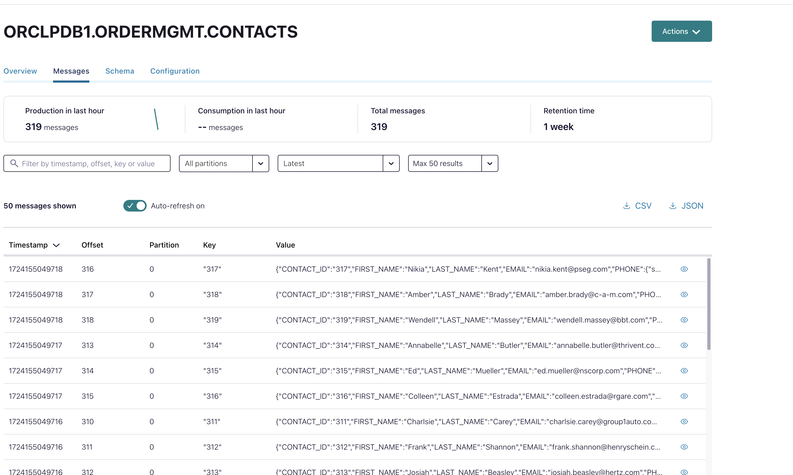
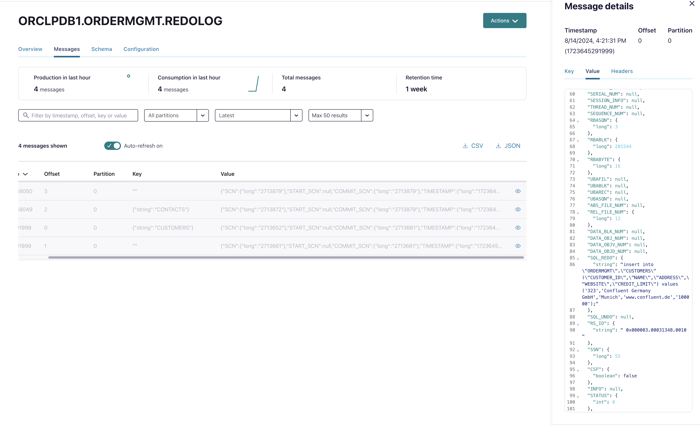
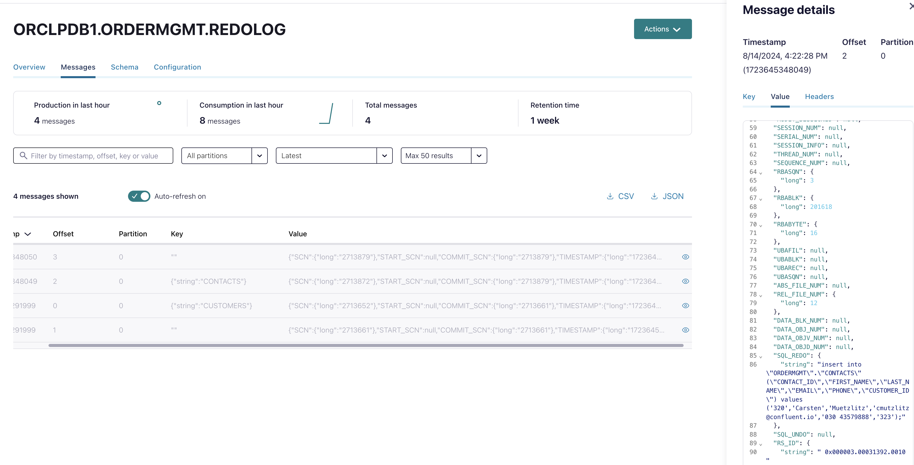
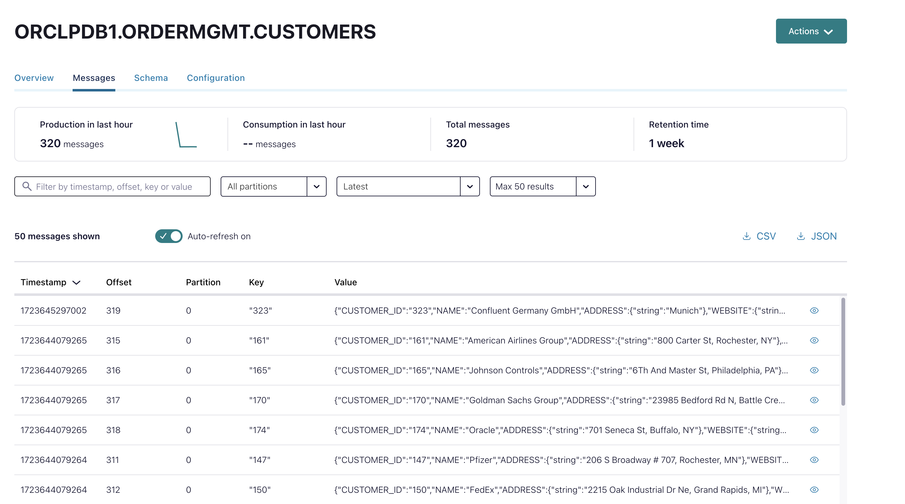
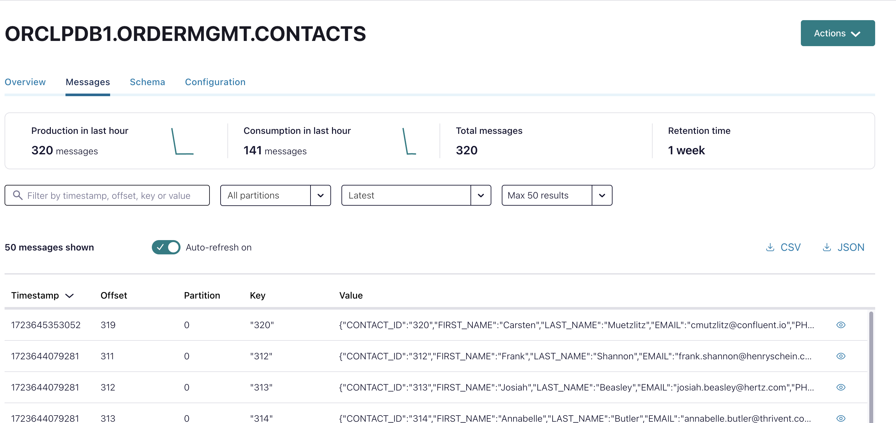

# Oracle CDC Source Connector

For the workshop, we will deploy only one connector; please refer to **Deploy Oracle CDC Source Connector** for more details. Based on our knowledge, the Oracle CDC Connector requires each connector to have its own unique redo log topic. This topic should not be shared between connectors, and each redo log topic contains only one partition. This setup creates a bottleneck for the throughput of a single connector. For example, a partition typically has a maximum throughput of 10 MB/s (such as in Confluent Cloud Dedicated Clusters). Therefore, customers needing more than 10 MB/s throughput will have to run multiple connectors against a single database or PDB. It is important to note that doing so will increase the load on the database.

* *(Optional)* To address this situation, we have developed an alternative solution where we create three connectors for a single database. For more information, see [Running 3 CDC Connectors](3connectors/README.md).

## Deploy Oracle CDC Source Connector

Oracle Database is running and now we will deploy CDC Connector:
   
```bash
cd ../ccloud-source-oracle-cdc-connector/
source .ccloud_env 
terraform init
terraform plan
terraform apply
```

Terraform should deploy the connector successfully with this output:

```bash
# Apply complete! Resources: 1 added, 0 changed, 0 destroyed.
# Outputs:
# A00_Oracle_CDC_Connector = "Login into your Confluent Cloud Console and check in your cluster if Oracle CDC Source Connector is running"
```

The connector is creating a couple of topics with the correct schema aligned:

* First we will see all the table change topics in the format : `<PDBNAME>.<DBSCHEMA>.<TABLENAME>`. The first initial load of all data (snapshot) will be executed first
* Later we have the redolog topic `XEPDB1.ORDERMGMT.REDOLOG` if a change is happing on the Oracle DB.

The connector will create all topics and schemas for the database table we want to integrate. In our case we configured to use the following tables

```bash
"table.inclusion.regex" = "XEPDB1[.]ORDERMGMT[.](ORDER_ITEMS|ORDERS|EMPLOYEES|PRODUCTS|CUSTOMERS|INVENTORIES|PRODUCT_CATEGORIES|CONTACTS|NOTES|WAREHOUSES|LOCATIONS|COUNTRIES|REGIONS)"
```

The result is a list of topics including AVRO schemas.


As the workload on the database increases, resources in the compute service also become scarce. Before deploying the CDC connector, we had a CPU usage rate of 0.1%, which rose to approximately 4% after deployment. It’s easy to imagine that the more connectors are deployed against a database, the higher the load on the database compute service will become. If the database workload is already high, careful consideration must be given to how to proceed.. See [3 Connecor deployment](3connectors/README.md).


The first task the connector is taking a snapshot of all the tables we want to include in our cluster (see "table.inclusion.regex"), which is known as the initial load. For example, in the topic XEPDB1.ORDERMGMT.CONTACTS, we currently have 319 events.


Please check the current dataset in our database:

```bash
ssh -i ~/keys/cmawskeycdcworkshop.pem ec2-user@$TF_VAR_oracle_host
sudo docker exec -it oracle21c /bin/bash
sqlplus ordermgmt/kafka@XEPDB1
SQL> select count(*) from CONTACTS;
  COUNT(*)
----------
       319
SQL> exit;
```

As expected we got the same amount of data. So now, we can try if the connector is really doing CDC. 
For a first demo please add yourself as new contact. Before doing that create a new customer.

```bash
sqlplus ordermgmt/kafka@XEPDB1
# First the customer, insert your company
SQL> insert into customers (name, address, website, credit_limit) values ('Confluent Germany GmbH', 'Munich', 'www.confluent.de', 100000);
SQL> commit;
# Commit complete.
SQL> select customer_id from customers where name ='Confluent Germany GmbH';
CUSTOMER_ID
-----------
        320
# Now the contact , with the ID of the created customer, Please do the insert more than one time , e.g. 4 time. We will do a de-duplication later.    
SQL> insert into contacts (first_name, last_name, email, phone, CUSTOMER_ID) values ('Carsten', 'Muetzlitz', 'cmutzlitz@confluent.io', '030 43579888',320 );
SQL> commit;
SQL> insert into contacts (first_name, last_name, email, phone, CUSTOMER_ID) values ('Carsten', 'Muetzlitz', 'cmutzlitz@confluent.io', '030 43579888',320 );
SQL> commit;
SQL> insert into contacts (first_name, last_name, email, phone, CUSTOMER_ID) values ('Carsten', 'Muetzlitz', 'cmutzlitz@confluent.io', '030 43579888',320 );
SQL> commit;
SQL> insert into contacts (first_name, last_name, email, phone, CUSTOMER_ID) values ('Carsten', 'Muetzlitz', 'cmutzlitz@confluent.io', '030 43579888',320 );
SQL> commit;
SQL> exit;
exit;
exit;
```

Now, the connector has created the redo log topic `XEPDB1.ORDERMGMT.REDOLOG` and the heartbeat topic `lcc-xxxxx-XEPDB1-heartbeat-topic`. The heartbeat topic if for really less update frequency. From this point forward, all changes will be stored in the redo log topic in the correct sequence (hence the redo log is limited to run with a single partition). 

> [!TIP]
> My experience is, without setting heartbeat `heartbeat.interval.ms` you will see an error "ORA-01291: missing log file".

We do see both changes know in redolog topic, first the entry for insert into customers


second the entries for insert into contacts


And finally the new entries are also visible in table topics, first new customer `Confluent Germany GmbH`


And the contact `Carsten Muetzlitz`


The connector is working pretty well.

We do have full logging configured in the database. If you want to play later with minimal logging, please [follow this simple guide](minimal_logging.md).

> [!TIP]
> We enabled full logging on the complete database in our workshop. It is better for the database that you set supplemental logging for tables only (in our case 13 Tables).

back to [Deployment-Steps Overview](../README.MD) or continue with the other [DB Services MySQL and PostGreSQL](../mysql_postgres/Readme.md)