# Connector Migration: Local and self-managed Oracle CDC Connector migrate to fully-managed Oracle CDC Connector

# Table of Contents

1. [Run connect to Confluent Cloud](#Run-connect-to-Confluent-Cloud)
2. [Monitor connector](#Monitor-connector)
3. [Connector migration](#Connector-migration)
4. [Stop local resourses](#Stop-local-resourses)

> [!NOTE]
> if you do not have `jq` installed, don't use it later in the code.

# Run connect to Confluent Cloud

We need

* Confluent Cloud Cluster is running
* Oracle compute service is running
* We need a Confluent Platform Connect 7.6 or higher. I use Connect 7.7 in docker-compose and for this I used JDK 11, check your java: `java -version`


Start local connect cluster to Confluent Cloud with Oracle CDC Connector self-managed.

```bash
cd ccloud-source-oracle-cdc-connector/migrateConnectors
source .env
# start environment
docker-compose -f docker-compose-cdc-ccloud_new.yml up -d
docker-compose -f docker-compose-cdc-ccloud_new.yml ps

```

Connect cluster should now run to Confluent Cloud. In Confluent Cloud we do see this client in our Stream Lineage Visualizer.
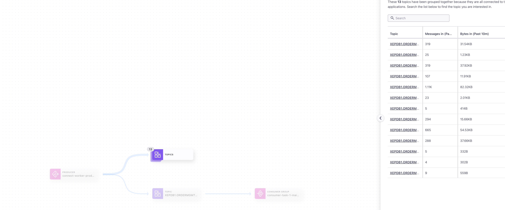


Start the data generator in DB

```bash
# ssh into compute
ssh -i ~/keys/cmawskeycdcworkshop.pem ec2-user@X.X.X.X
# Execute into container
sudo docker exec -it oracle21c /bin/bash
sqlplus ordermgmt/kafka@XEPDB1
SQL> @/opt/oracle/scripts/setup/06_data_generator.sql
SQL> 
begin
   produce_orders;
end;
/
```


A best practice of such a setup - self-managed connectors with Confluent Cloud - is to use Hybrid Health+ setup. This is quite easy to setup, the standard version of confluent Health+ is free of charge. The bi advantage is that you see in Confluent Cloud Monitoring how many connectors running against your Confluent Cloud cluster. Please see [Confluent documentation for hybrid health+ setup](https://docs.confluent.io/platform/current/health-plus/enable-health-plus.html). We do not cover this setup here.


# Monitor connector

The docker-compose created prometheus and Grafana for us. Check if you can access the website.

You can see all targets in prometheus in [Dashboard](http://localhost:9090/targets). The most important target is our connect cluster.
[Login](http://localhost:3000/login) to Grafana via admin/admin and choose the connect cluster under Dashboards first. No, data is visible

The Connect Monitoring Dashboard in Grafana looks like:
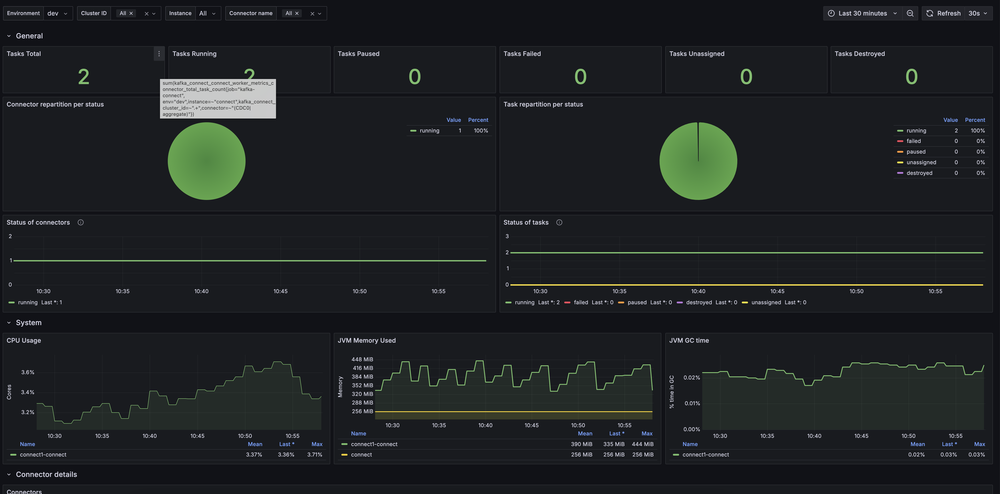

The CDC Connector Monitoring looks like this
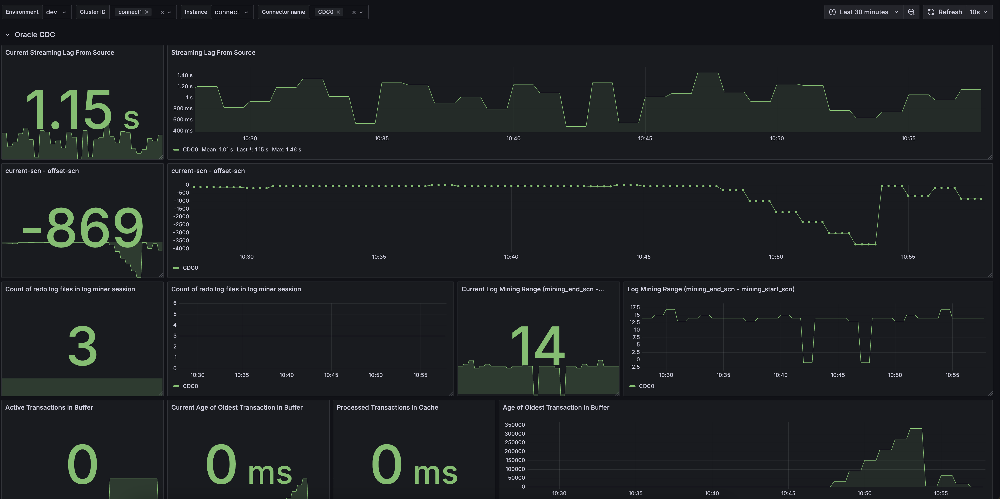

Now we would like to check our self-managed connect cluster:

```bash
# Connect cluster status
curl localhost:8083/ | jq
# No running connectors so far
curl localhost:8083/connectors | jq
# One Conenctor plugin for Oracle CDC 2.14.1 (latest version 17-SEPT.2024), and mirror maker
curl localhost:8083/connector-plugins/ | jq
```
Our database is already running. We could start now our local and self-managed Oracle CDC Connector:

```bash
# We need first to convert with the correct values
cp cdc_ccloud.json.template cdc_ccloud.json
# Now change all Variables in Json with your correct values: Replace this
# ${TF_VAR_oracle_host}
# ${bootstrap}
# ${connectorkey}
# ${connectorsecret}
# ${bootstrap}
# ${connectorkey}
# ${connectorsecret}
# ${srkey}
# ${srsecret}
# ${srrestpoint}
# values with values from
cat .env
# in cdc_ccloud.json
```

With the correct Confluent Cloud cluster properties and Database Host, you can now start the connector:

```bash
# Are connectors running?
curl -s -X GET -H 'Content-Type: application/json' http://localhost:8083/connectors | jq
# start connector with correct json config
curl -s -X POST -H 'Content-Type: application/json' --data @cdc_ccloud.json http://localhost:8083/connectors | jq
# Check status
curl -s -X GET -H 'Content-Type: application/json' http://localhost:8083/connectors/CDC0/status | jq
# If connector is running, do not delete, only if it fails, then delete and fix the error and start again
# curl -s -X DELETE -H 'Content-Type: application/json' http://localhost:8083/connectors/CDC0 | jq
```


# Connector migration

A connector migration from self-managed to fully-managed can be executed easily with new offset feature in our connectors. You need to run the CP Connect Version 7.6 or higher. And the latest connector version is also recommend. We will follow this [API for CP 7.7 is able to stop and read offset](hhttps://docs.confluent.io/platform/current/connect/references/restapi.html#put--connectors-(string-name)-stop)

Confluent has prepared a migration guide for migrating e.g. self-managed to fully-managed connectors (our case here). It includes checklists and migration steps. For the migration we do expect running at least CP 7.6 or higher and have a connectors supporting a migration, see [supported connector](https://docs.confluent.io/cloud/current/connectors/offsets.html#source-connectors). 

Local Connector is now running with Confluent Cloud.
The connect do create all topics (Table topics)
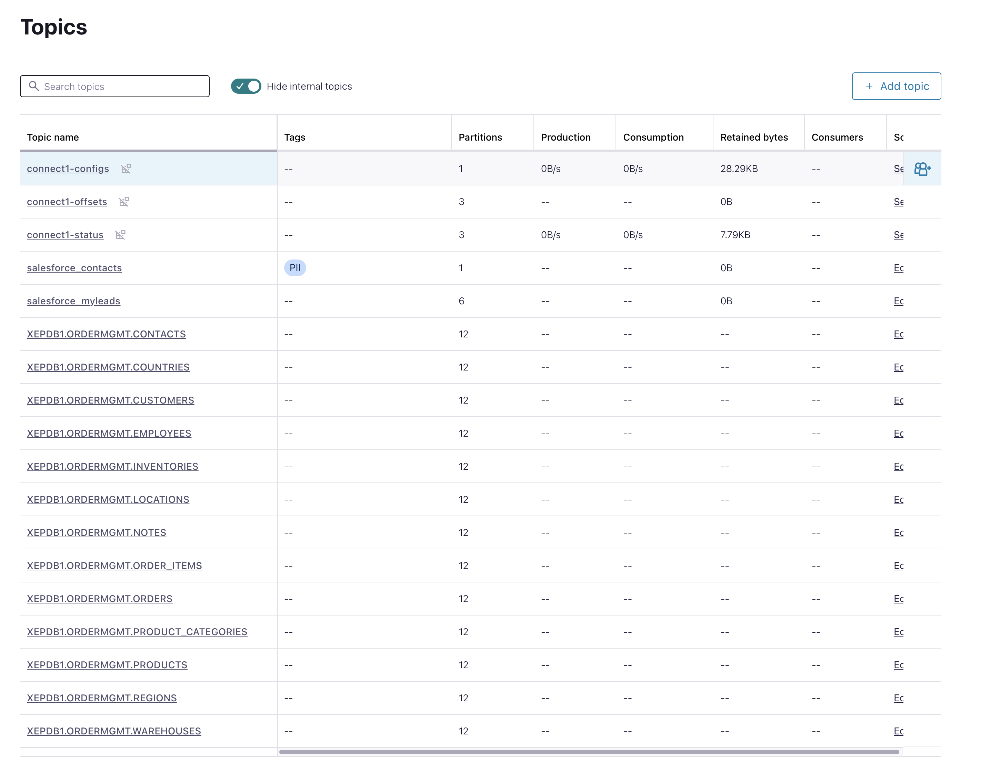

What the connector do first, is the initial load (snapshot)
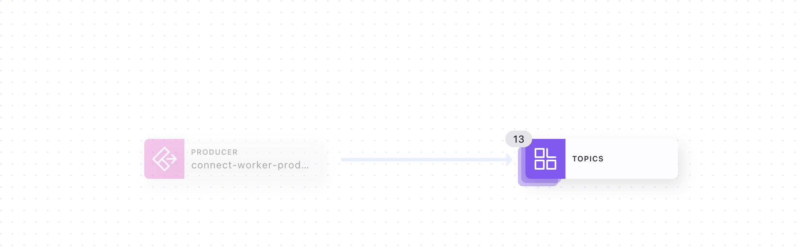

Data change is now visible in Kafka cluster as well. Redo Log topic was created.
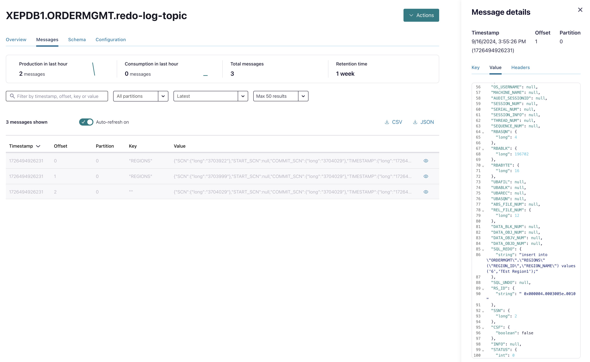

We will get now the last offset from connector, stop the connector and do't stop the data generator. This is the preparation for a migration, where downtime is possible.

```bash
# Status
curl -X GET http://localhost:8083/connectors/CDC0/status | jq
# If connector failed, restart
#curl -s -X POST -H 'Content-Type: application/json' http://localhost:8083/connectors/CDC0/restart | jq
#curl -X GET http://localhost:8083/connectors/CDC0/status | jq
# First stop, No Data loss/duplication Requirement (Downtime ok), Stopping ensures that you get the latest offset.
curl -X PUT  http://localhost:8083/connectors/CDC0/stop | jq
curl -X GET http://localhost:8083/connectors/CDC0/status | jq
# Get offset, Get offset of self-managed connector, write down the offset
curl -s -X GET -H 'Content-Type: application/json' http://localhost:8083/connectors/CDC0/offsets | jq
# Output 
# ...
# {
#   "offsets": [
#     {
#     {
#       "partition": {
#        "schema": "ORDERMGMT",
#         "catalog": "XEPDB1",
#         "table": "ORDERS"
#       },
#       "offset": {
#         "def": "ORDER_ID INT64 key,CUSTOMER_ID INT32,STATUS STRING,SALESMAN_ID INT32 optional,ORDER_DATE Date",
#         "rps": "0",
#         "cscn": "3645778",
#        "rows": "-1",
#         "scn": "3645777"
#       }
#     },
# ...
# DELETE connector
curl -s -X DELETE -H 'Content-Type: application/json' http://localhost:8083/connectors/CDC0 | jq
curl -X GET http://localhost:8083/connectors/CDC0/status | jq
```

In Confluent Cloud Topic Viewer, we can also check the last Entry in Orders topic.
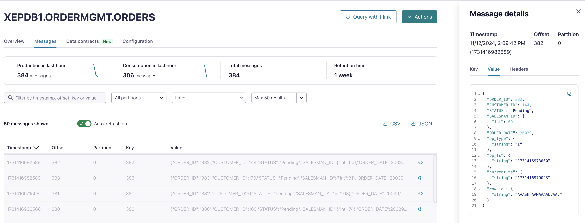

## Migrate to fully-managed Connector

To make easy this time we will create the connector in the Confluent Cloud UI. Got your Cluster, choose connectors and search for "Oracle.
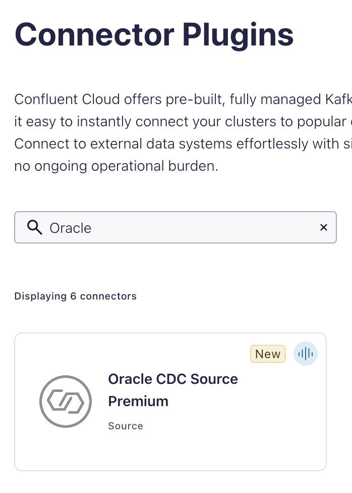

Click the Oracle CDC Connector and choose the connector Service account and check all required ACLs.
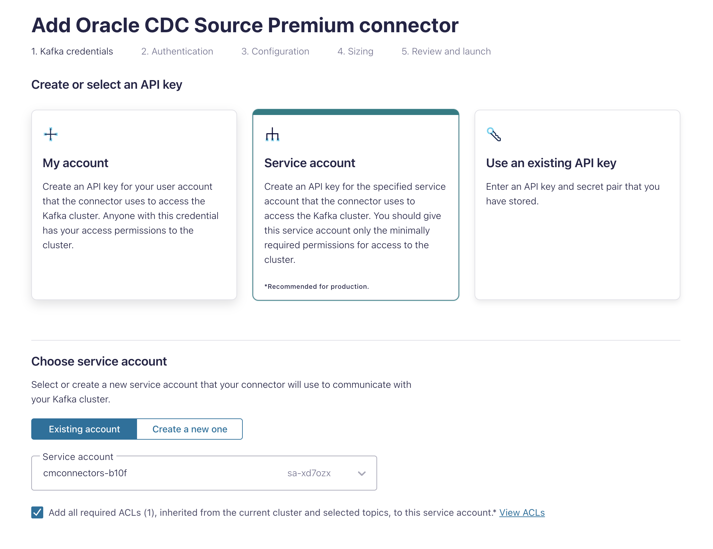

Enter all Oracle data and click continue.
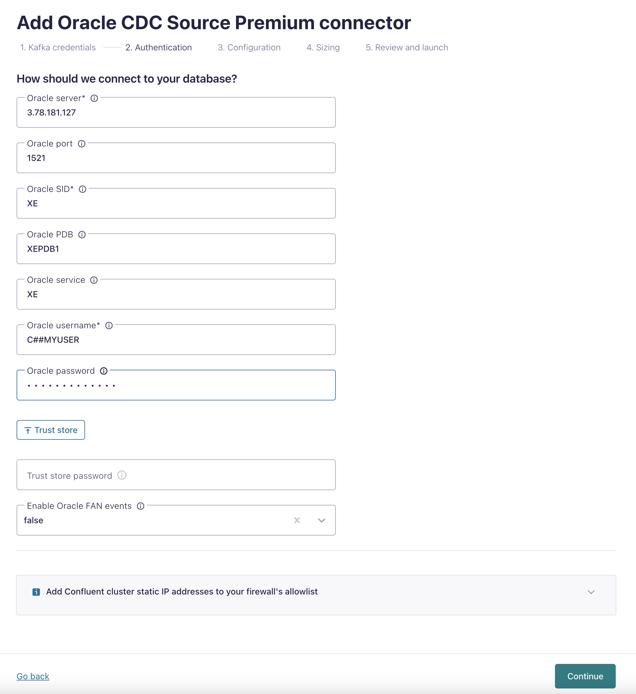

Add Config part2 and click on the advanced link
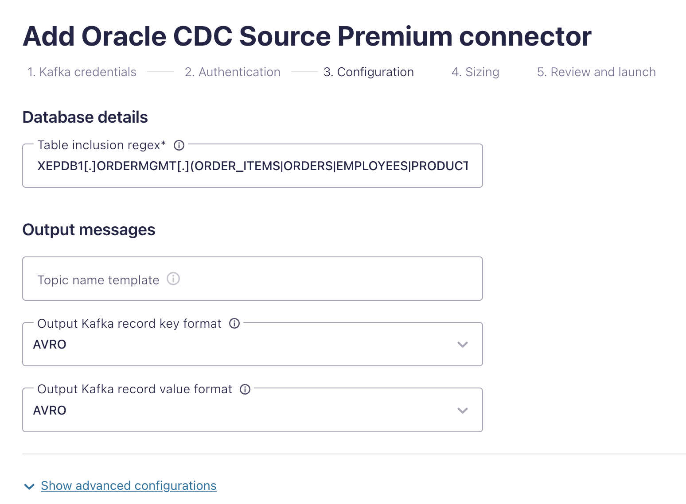

I did use `current` as parameter for start.from property. We do have the initial load already.

Add the complete offsets output from above API Call. In my case

```bash
[
    {
      "partition": {
        "sidPdb": "XE.XEPDB1"
      },
      "offset": {
        "tablePlacement": "",
        "scn": "3642464"
      }
    },
    {
      "partition": {
        "schema": "ORDERMGMT",
        "catalog": "XEPDB1",
        "table": "ORDERS"
      },
      "offset": {
        "def": "ORDER_ID INT64 key,CUSTOMER_ID INT32,STATUS STRING,SALESMAN_ID INT32 optional,ORDER_DATE Date",
        "rps": "1",
        "cscn": "3642392",
        "rows": "-1",
        "scn": "3642391"
      }
    }
  ]
```

It looks like the following image (we need the `[..]` content) and click continue:
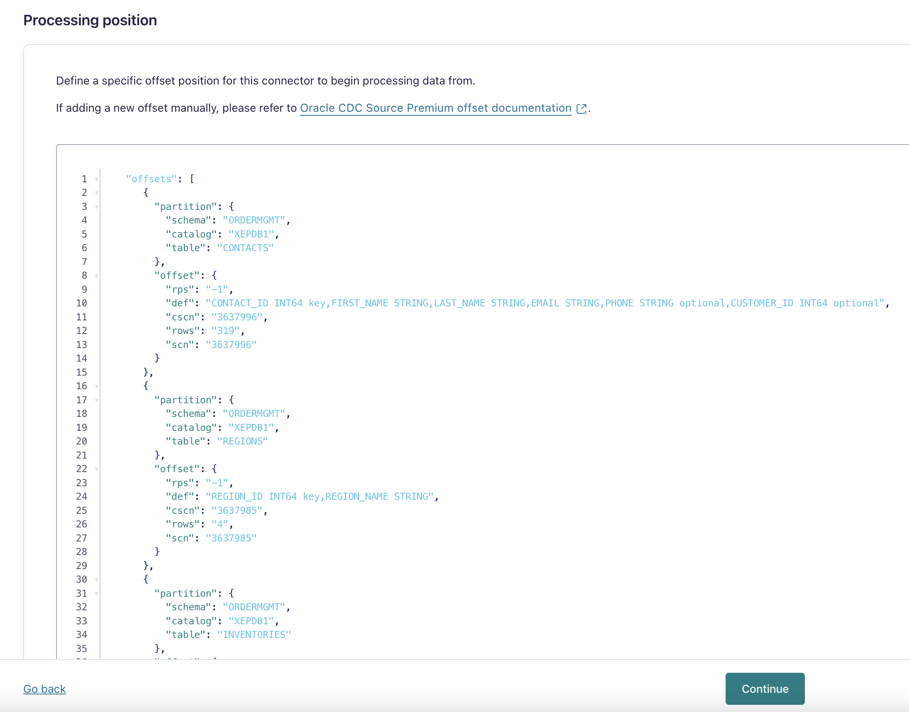

Start with 1 Task:
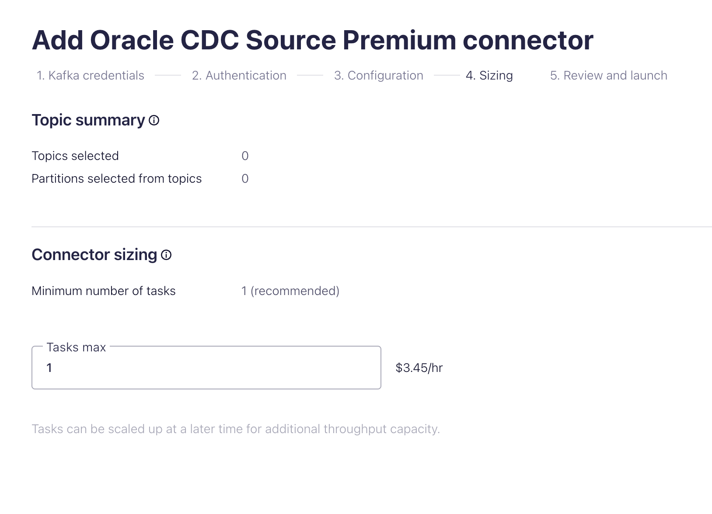

Final check and click continue
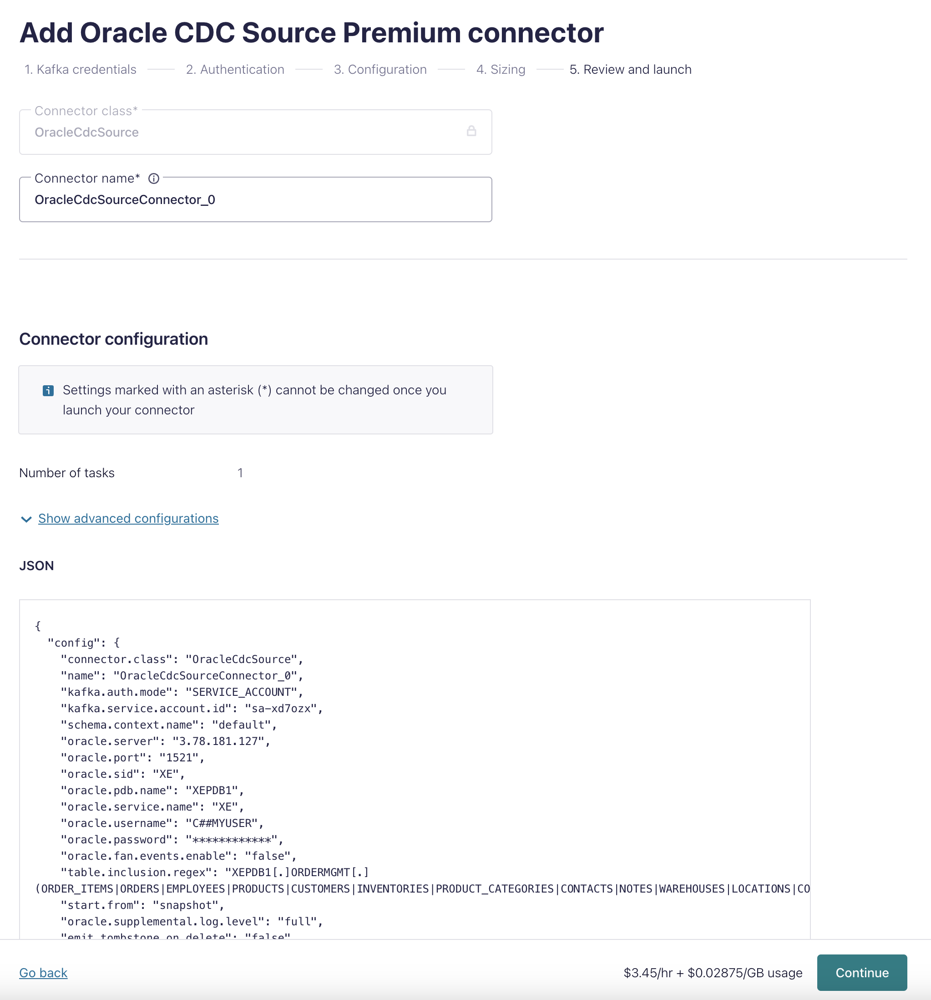

Now connector is launched and start from last offset for all topics. The provisioning takes longer because of the offset setting. We can check the order Topic and compare what was the last event record. It was order_id 382. All new records where produce via new connector
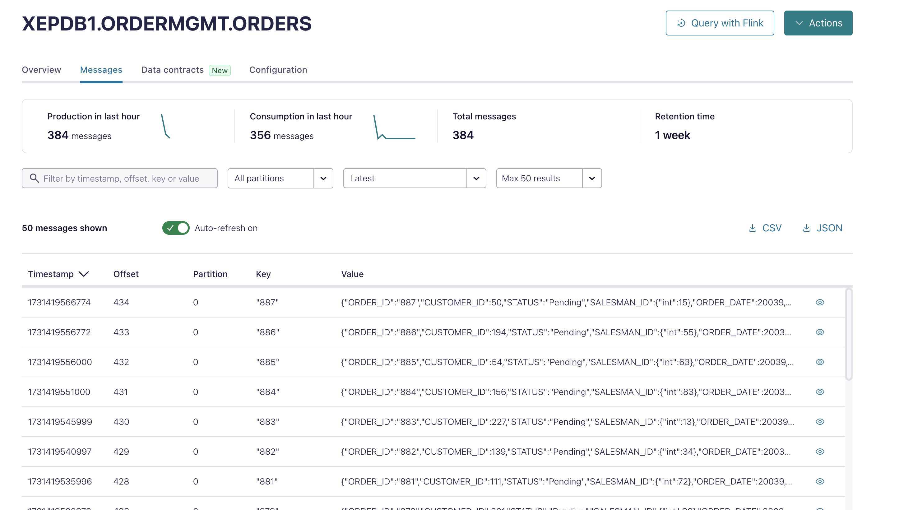


# Stop local resourses

Stop containers.

```bash
docker-compose -f docker-compose-cdc-ccloud_new.yml down -v
```

Delete Connector in Confluent Cloud UI. Go into cluster -> Connectors -> Choose CDC Connector -> Settings and click delete connector
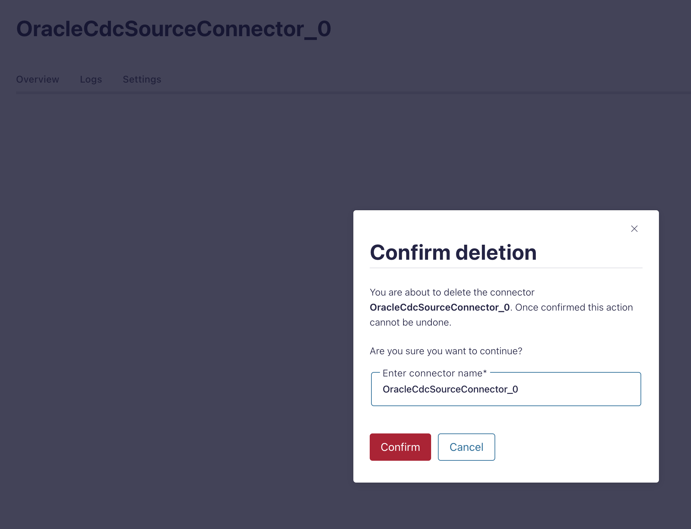

back to [Deployment-Steps Overview](../README.MD) or continue with the other [Oracle CDC Connector](../README.md )
