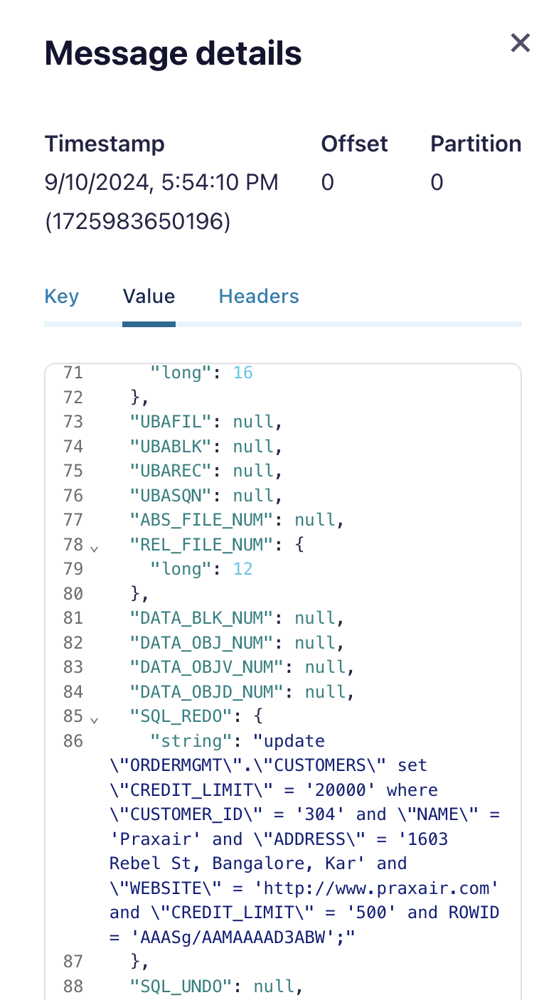
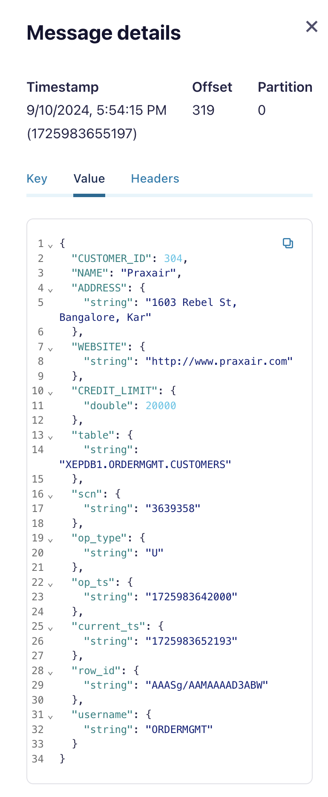
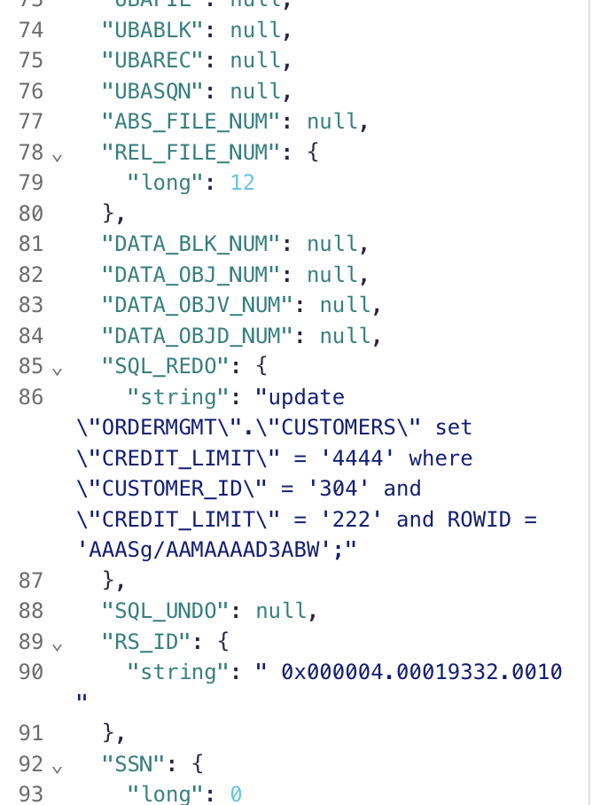

# Play with minimal supplement logging in the database

be sure the following are already running

* Confluent Cloud cluster is created
* Oracle DB Service is running
* Confluent Oracle CDC Connector is running

## Play in Oracle

Login and change setting and update customers table.

```bash
ssh -i ~/keys/cmawskeycdcworkshop.pem ec2-user@PUBIP
sudo docker exec -it oracle21c /bin/bash
sqlplus ordermgmt/kafka@XEPDB1
SQL> update customers set credit_limit=20000 where customer_id=304;
SQL> commit;
``` 

##  Check output in Redo Log and customers tables topic

The change was produced to redolog topic XEPDB1.ORDERMGMT.REDOLOG
The statement `update customers set credit_limit=20000 where customer_id=304;` was automatically enhanced with `update \"ORDERMGMT\".\"CUSTOMERS\" set \"CREDIT_LIMIT\" = '20000' where \"CUSTOMER_ID\" = '304' and \"NAME\" = 'Praxair' and \"ADDRESS\" = '1603 Rebel St, Bangalore, Kar' and \"WEBSITE\" = 'http://www.praxair.com' and \"CREDIT_LIMIT\" = '500' and ROWID = 'AAASg/AAMAAAAD3ABW';` with all missing columns and actual values.




The change was also added to table topic XEPDB1.ORDERMGMT.CUSTOMERS



Now try to change logging in the database

```SQL
SQL> connect sys/confluent123@XEPDB1 as sysdba
SQL> SELECT SUPPLEMENTAL_LOG_DATA_MIN, SUPPLEMENTAL_LOG_DATA_PK, SUPPLEMENTAL_LOG_DATA_ALL FROM V$DATABASE;
SUPPLEME SUP SUP
-------- --- ---
IMPLICIT NO  YES
SQL> SELECT * FROM ALL_LOG_GROUPS WHERE OWNER='ORDERMGMT' and TABLE_NAME='CUSTOMERS';

# Do minimal logging see https://docs.confluent.io/kafka-connectors/oracle-cdc/current/minimal-supplemental-logging.html
SQL> connect sys/confluent123@XE as sysdba
SQL> ALTER DATABASE DROP SUPPLEMENTAL LOG DATA (ALL) COLUMNS;
SQL> SELECT SUPPLEMENTAL_LOG_DATA_MIN, SUPPLEMENTAL_LOG_DATA_PK, SUPPLEMENTAL_LOG_DATA_ALL FROM V$DATABASE;
SUPPLEME SUP SUP
-------- --- ---
NO       NO  NO
SQL> SELECT SUPPLEMENTAL_LOG_DATA_MIN, SUPPLEMENTAL_LOG_DATA_PK, SUPPLEMENTAL_LOG_DATA_ALL FROM V$DATABASE;
SQL> ALTER DATABASE ADD SUPPLEMENTAL LOG DATA;
SQL> connect sys/confluent123@XEPDB1 as sysdba
SQL> ALTER TABLE ORDERMGMT.CUSTOMERS ADD SUPPLEMENTAL LOG DATA (PRIMARY KEY) COLUMNS;
SQL> SELECT SUPPLEMENTAL_LOG_DATA_MIN, SUPPLEMENTAL_LOG_DATA_PK, SUPPLEMENTAL_LOG_DATA_ALL FROM V$DATABASE;
SUPPLEME SUP SUP
-------- --- ---
YES      NO  NO
SQL> SELECT * FROM ALL_LOG_GROUPS WHERE OWNER='ORDERMGMT' and TABLE_NAME='CUSTOMERS';
# Login as schema owner and change data
SQL> connect ordermgmt/kafka@XEPDB1
SQL> update customers set credit_limit=4444 where customer_id=304;
SQL> commit;
```

## Check output in Redo Log and customers tables topic

The change was produced to redolog topic XEPDB1.ORDERMGMT.REDOLOG
The statement `update customers set credit_limit=4444 where customer_id=304;` was automatically enhanced with `update \"ORDERMGMT\".\"CUSTOMERS\" set \"CREDIT_LIMIT\" = '4444' where \"CUSTOMER_ID\" = '304' and \"CREDIT_LIMIT\" = '222' and ROWID = 'AAASg/AAMAAAAD3ABW';`, so all the missing columns are not involved anymore. The save storage in the cluster and network.



But the change was not written into the table topic XEPDB1.ORDERMGMT.CUSTOMERS anymore. The production of changes from redolog to table topics needs to be done manually by implemented an application. This is the caveat.

Back to [Oracle CDC setup](README.md)