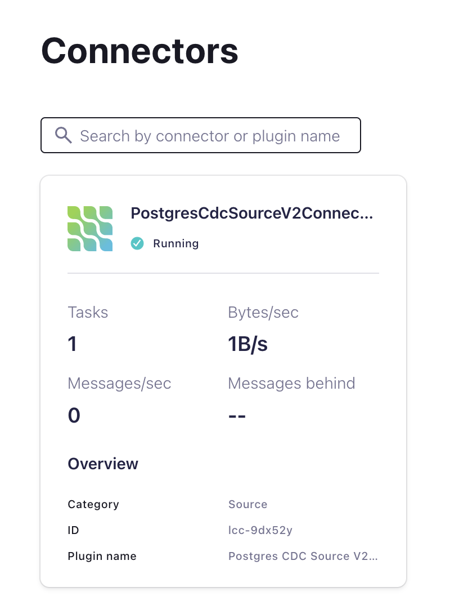
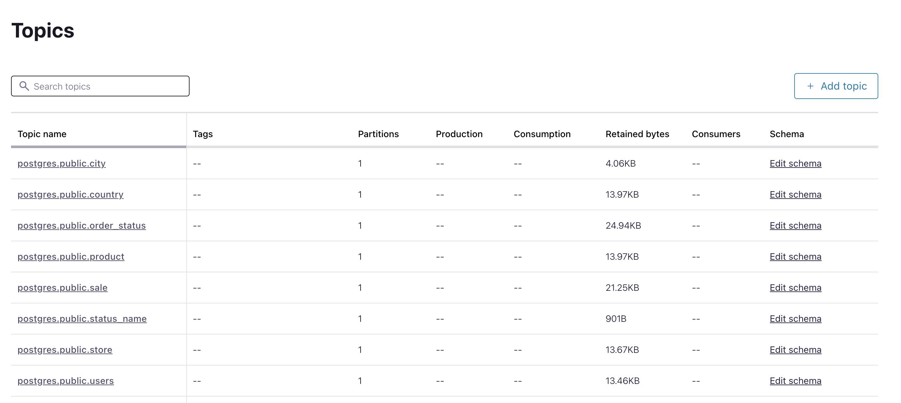
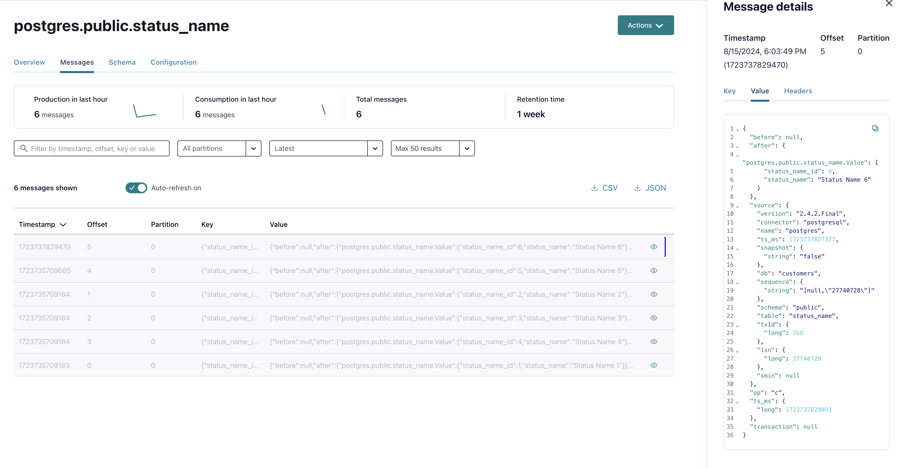

# DeployPostgres CDC Source V2 (Debezium) connector

Activate the postgres CDC Connector in Confluent Cloud:

```bash
cd ../ccloud-source-postgresql-cdc-connector
source .ccloud_env
terraform init
terraform plan
terraform apply
```

Terraform will output after a successful deployment:

```bash
# Apply complete! Resources: 1 added, 0 changed, 0 destroyed.
# Outputs:
# A00_POSTGRES_CDC_Connector = "Login into your Confluent Cloud Console and check in your cluster if postgreSQL CDC Source Connector is running"
```

The postgres CDC Connector is running.


Terraform need a while to close. But the connector is working already.
The connector will create new topics `<topic.prefix>.public.<tablename>`. 


Topics are created automatically.

Try to insert a new record:

```bash
ssh -i ~/keys/cmawskeycdcworkshop.pem ec2-user@$TF_VAR_host_name
# INSERT
sudo docker exec -it postgres psql -U postgres-user -d customers
customers=# INSERT INTO STATUS_NAME VALUES (6, 'Status Name 6');
# INSERT 0 1
customers=# select * from status_name;
# status_name_id |  status_name  
#----------------+---------------
#              1 | Status Name 1
#              2 | Status Name 2
#              3 | Status Name 3
#              4 | Status Name 4
#              5 | Status Name 5
#              6 | Status Name 6
customers-# \q
$ exit
```

Try to find this record in Confluent Cloud console topic viewer.


back to [Deployment-Steps Overview](../README.MD) or continue with [Salesforce CDC Connector setup](../ccloud-source-salesforce-cdc-connector/README.md)