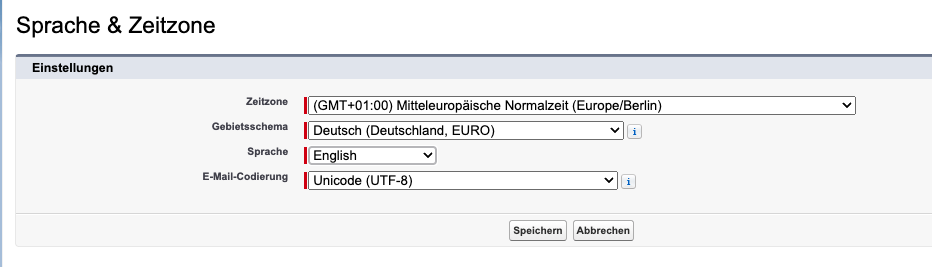
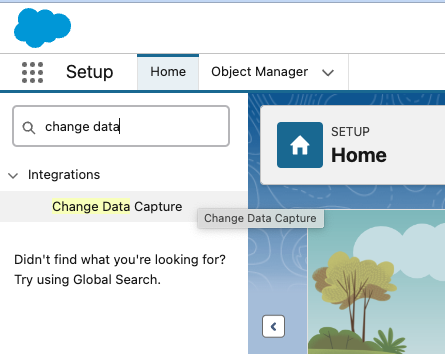
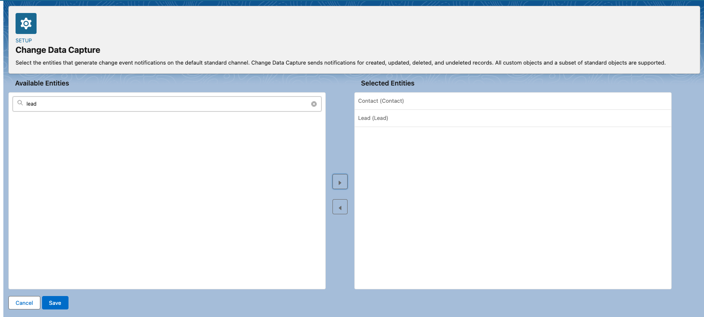
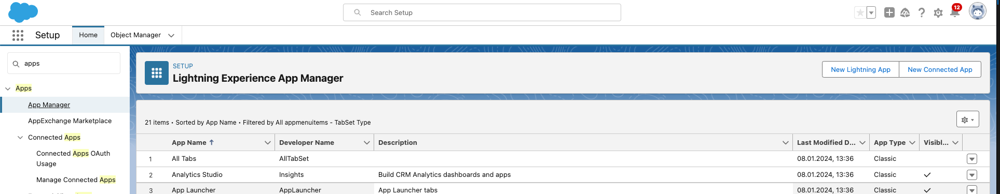
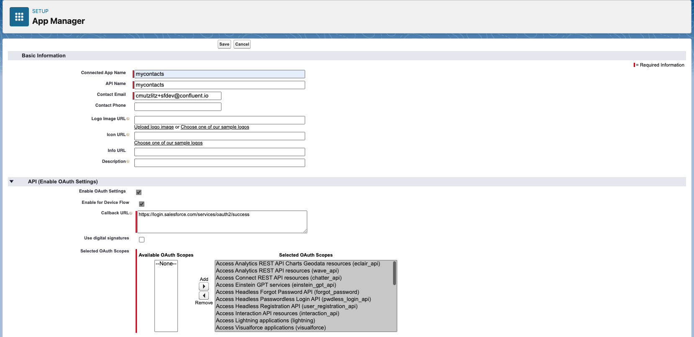
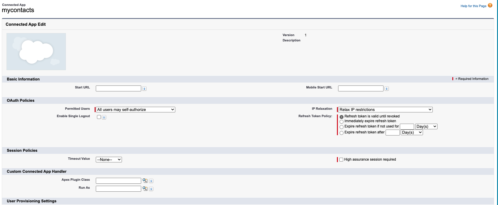
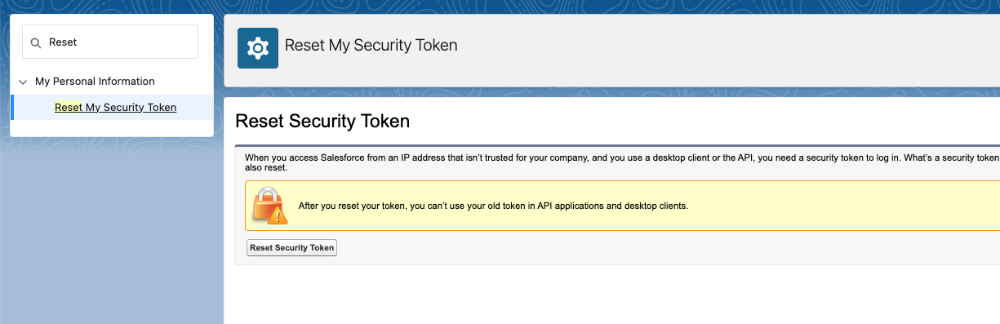
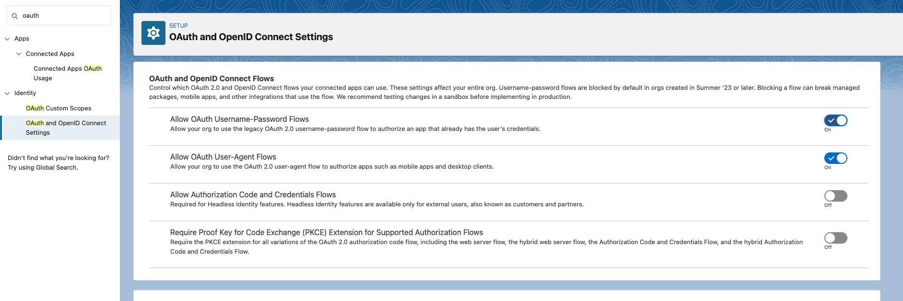
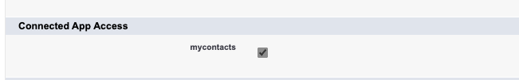

# Setup Salesforce Developer Account

> [!CAUTION]
> Please do the setup at least 1 or better days before the workshop. A new Account Setup will take a while.

Start with Developer Account Sign-up [here](https://developer.salesforce.com/signup)

In our documentation you will find a couple of entries how to configure Salesforce CDC:
* Configure Salesforce CDC: see [docu](https://docs.confluent.io/cloud/current/connectors/cc-salesforce-source-cdc.html#quick-start)
* Configure SALESFORCE for CDC. [follow these steps](https://developer.salesforce.com/docs/atlas.en-us.change_data_capture.meta/change_data_capture/cdc_select_objects.htm)
* Follow this setup from [Vincent](https://github.com/vdesabou/kafka-docker-playground/tree/master/connect/connect-salesforce-cdc-sourcesalesforcesalesforceCDC)

Login with your created login. If you Sign-up the first, you will get an email. [Login](https://confluent-1b-dev-ed.develop.my.salesforce.com) to Salesforce with your username.

> [!CAUTION]
> The following steps need to be configured very focused. If you miss something, the connector is not working.
> E.g. I forgot to save the Change Data Capturing Selection of (Contact), and the connector deployment throws error: salesforce.cdc.name: Could not find the specified CDC channel in your Salesforce organization. So, please be precise.


Here are my steps with current screenshots (Aug. 2024):
1. first setup language to english, otherwise you need the words in current language  (Setting under User) 



2. Switch to **Setup**, click on the **wheel** (right upper corner) and
search for Change Data Capture in quick search box in Lightning (left side upper field).




3. choose entity **contact**  and move it to right side (selected entities). We will work only with **Contacts** in the demo. Click **Save**.



The corresponding CDC Name is **ContactChangeEvent**.

4. My user is system administrator (normal developer user, after login)
search for **apps** and click on **App Manager** and then **New Connected App** (right upper corner) 



5. enter values for the app (see image), and click **save** and then click **continue**



6. click **Manage Consumer Details** and a new tab is opened, wait for an Email with a verification code and enter the code and you will see the **consumer key and secret**. Save them, we need it for the connector. The relevant pieces of information are the Consumer Key and the Consumer Secret. 
Go back to old tab. Click on **Manage** and change by **Edit Policies** and choose IP Relaxation: **Relax IP restrictions**.  Click **Save**



7. Switch to personal **settings** by clicking an the account avatar right upper corner and then **settings**. In the Quick Find box search for  **Reset**, and then select **Reset My Security Token**. Click **Reset Security Token**. A new security token is sent to the email address of the current user. Save password security token for later use.



8. search for oauth and set under **OAuth and openID Connect Setting** the **Allow OAuth User-name-Password Flows** to enable  



9. Search for **profile** in quick finder (upper left corner), click under **Users** on **Profiles**, edit System Administrator and enable under **Connected app** category **mycontacts**. Click **save**.



Now you everything is configured in Salesforce. The Salesforce Connector parameters will stored later in  `.accounts`:

```bash
 sf_user = "salesforce user"
 sf_password = "password"
 sf_cdc_name = "ContactChangeEvent"
 sf_password_token = "password token"
 sf_consumer_key = "consumer key of connected app"
 sf_consumer_secret = "consumer secret of connect app"
```
Salesforce CDC configuration is finished.

back to [Deployment-Steps Overview](../README.MD) or [Salesforce CDC Connector Deployment Page](README.md).
