# Data Processing with Flink SQL

## Content

[1. Transform Salesforce Data](dataprocessingREADME.md#1-Transform-Salesforce-Data)

[2. Transform Oracle Data and enrich with genAI](dataprocessingREADME.md#2-Transform-Oracle-Data-and-enrich-with-genAI)

[3. Transform mySQL Data](dataprocessingREADME.md#3-Transform-mySQL-Data)

[4. Transform PostGreSQL Data](dataprocessingREADME.md#4-Transform-PostGreSQL-Data)

[5. Join all transformed contacts and do de-duplication and masking](dataprocessingREADME.md#5-Join-all-transformed-contacts-and-do-de-duplication-and-masking)

## 1. Transform Salesforce Data

> [!TIP]
> You can decide working in the UI or Shell. To open shell run `confluent flink compute-pool list --environment $TF_VAR_envid; export POOLID=<SEARCH ID> confluent flink shell --compute-pool $POOLID --environment $TF_VAR_envid`


Flink SQL Pool was deployed with the Confluent Cloud cluster
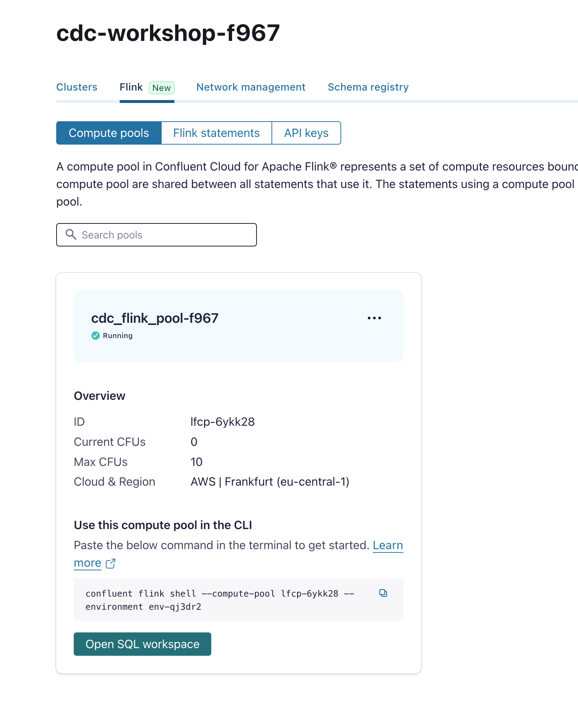

Please open SQL workspace by clicking on the button **open SQL workspace** or use the compute pool cli (here you need to install confluent cli first).
You need to proof that the workshop (our Confluent Cloud Environment Name) and database (the Confluent Cloud Cluster name) has been chosen correctly.

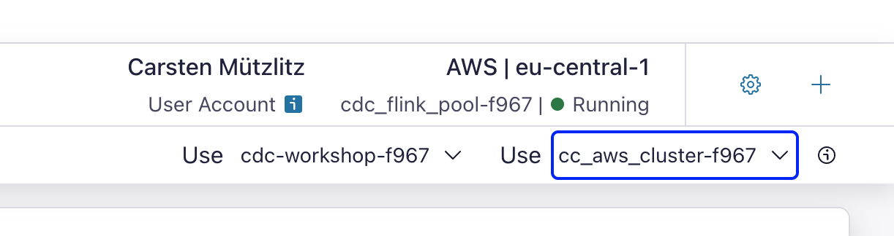

If you connected correctly you will see all topics in the Navigator.

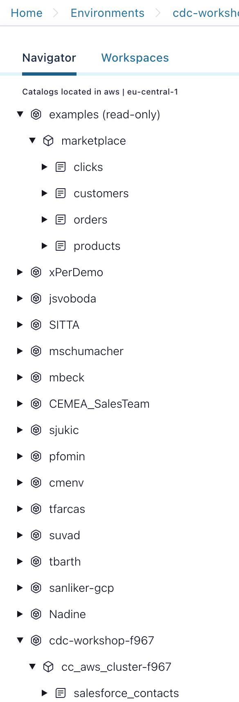

You can select the topics by executing in workspace editor SQL, e.g.:

```SQL
select * from salesforce_contacts;
```

The result is our created new contact in Salesforce.

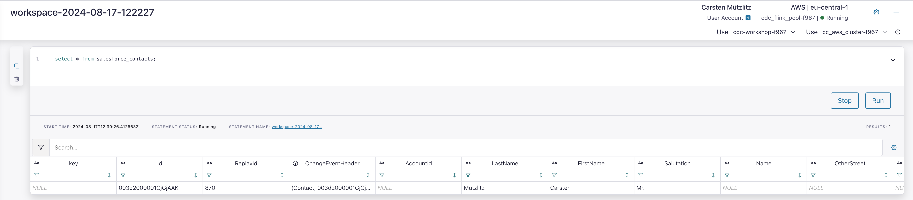

The Salesforce CDC Connector does really load the data into a structured way. Anyway, I would to start with a first transformation. We create a new table and add only those data we need:

Create the Table:

```SQL
CREATE TABLE salesforce_mycontacts(saluation STRING, firstname STRING,lastname STRING, email STRING);
```

Then please create the job to fill the new table.

```SQL
INSERT into salesforce_mycontacts SELECT Salutation, FirstName, LastName, Email FROM salesforce_contacts;
```

Now, you can check if data is arrived:

```SQL
select * from salesforce_mycontacts;
```

This INSERT job is visible under **Flink Statements**. Go back to environment view, choose **Flink (new)**, choose **Flink Statements**.

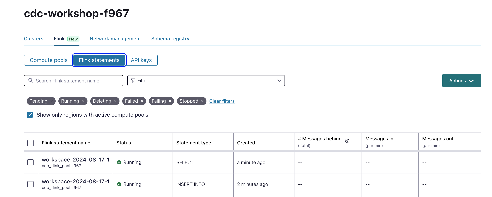

Click on the INSERT INTO Job and check what is happing in the Status view.

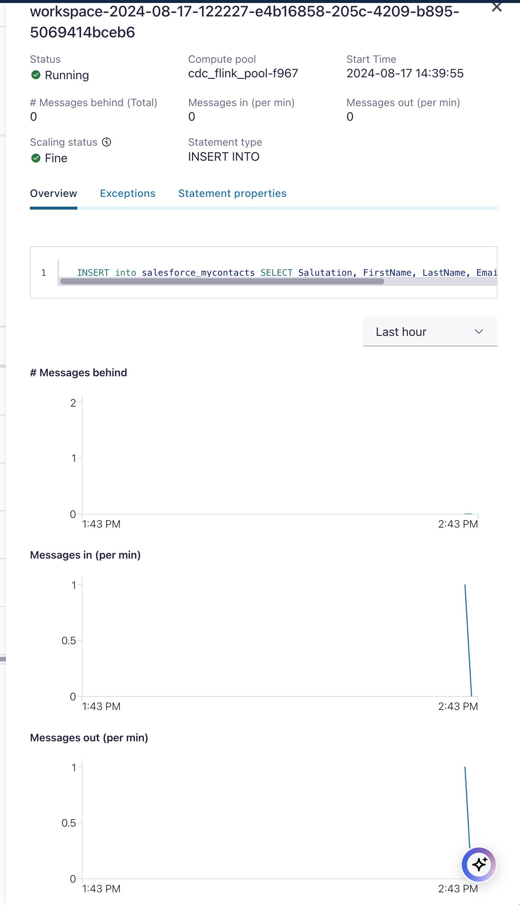

## 2. Transform Oracle Data and enrich with genAI

The Oracle CDC Connector did deploy a couple of Table-topics in our cluster. The Connector did create tables automatically and added also the schemas.
The Flink Navigator shows all tables available to work with:

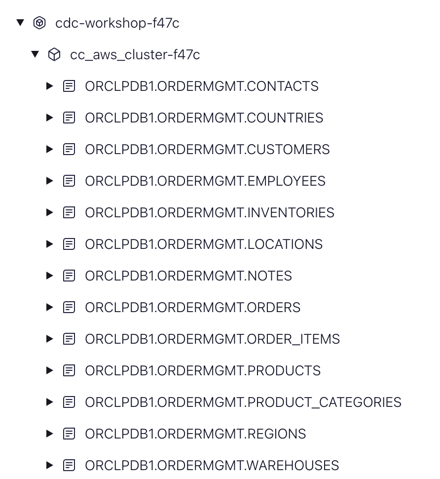

We transform the table contacts and products first. New Table for Oracle contacts

```SQL
select * from `XEPDB1.ORDERMGMT.CONTACTS`;
```

Prepare transformed view:

```SQL
CREATE TABLE oracle_mycontacts(saluation STRING, firstname STRING,lastname STRING, email STRING);
```

New Table for Oracle Products, check first the table-topic content:

```SQL
select * from `XEPDB1.ORDERMGMT.PRODUCTS`;
```

Create the transformed table for products including a new column filled by openAI.

```SQL
CREATE TABLE oracle_products(PRODUCT_NAME STRING, DESCRIPTION STRING, LIST_PRICE DECIMAL, SELLING_INFO STRING);
```

Then please create the job to fill the new tables. Start with Contacts;

```SQL
INSERT into oracle_mycontacts SELECT 'Mrs./Mr.', FIRST_NAME, LAST_NAME, EMAIL FROM `XEPDB1.ORDERMGMT.CONTACTS`;
```

Check the outcome:

```SQL
select * from oracle_mycontacts;
```

Now fill the oracle_product table and add generated AI Information to the new table column **selling Information**. The idea behind this is that we have not enough money to pay a product copywriter. That's why we do it with the help of openAI:
Create the Connection first and then the Model:

First create the connection in terminal (you need a pretty fresh confluent cli here, my version is 4.4):

```Bash
confluent flink connection create openai-connection --cloud AWS --region eu-central-1 --type openai --endpoint https://api.openai.com/v1/chat/completions --api-key  $OPENAI_API_KEY --environment $TF_VAR_envid
```

Create the AI Model:

```SQL
CREATE MODEL cdcproductgenai_openai_model INPUT(prompt STRING) OUTPUT(response STRING) COMMENT 'cdcproductgenai-openai' WITH ('task' = 'text_generation','provider'='openai','openai.connection' = 'openai-connection','openai.model_version' = 'gpt-3.5-turbo', 'openai.system_prompt'='You are helping me to create a best selling description for a product. Give a best selling product info for the product');
```

The model can now described

```SQL
describe model cdcproductgenai_openai_model;
```

Then create the fill job, with integrated openAI Call.

```SQL
INSERT into oracle_products SELECT PRODUCT_NAME, DESCRIPTION, LIST_PRICE, response FROM `XEPDB1.ORDERMGMT.PRODUCTS`, LATERAL TABLE(ML_PREDICT('cdcproductgenai_openai_model', concat(PRODUCT_NAME,' ',DESCRIPTION)));
```

Check the results: The nice Selling Information should now visible for you.

```SQL
select * from oracle_products;
```

> [!WARNING]
> Using OpenAI does incur costs, so please be mindful of how you design your tasks. This example is intended to demonstrate how easy it is to generate valuable content.

You can also have a look into the new create table or topic.
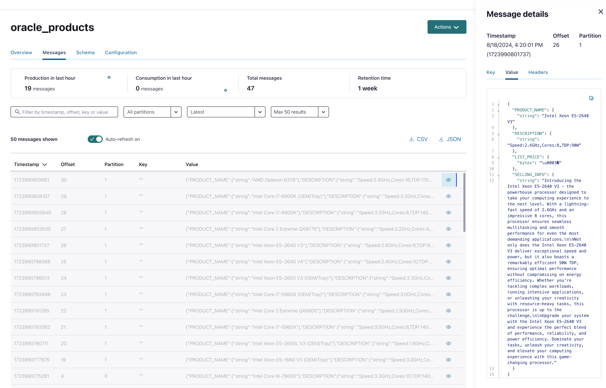

## 3. Transform mySQL Data

The MySQL database includes a simple table called `accounts`. This table has been CDC-enabled and is now streaming into a topic, with the connector set to produce all subsequent data changes. The `accounts` table serves as a contact database. As you may know, Debezium connectors generally follow a similar structure, where each record includes a 'before' and 'after' value struct. This means that typically, you'll need to transform these structs into a flat structure, similar to what you've done previously with the Confluent Oracle CDC and Salesforce CDC in earlier labs."

We can see in the Navigator the following MySQL Tables:
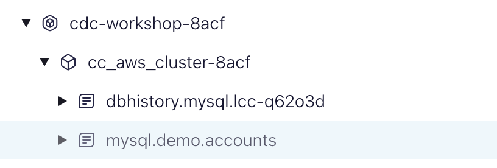

Transform the data into a new table. First show the table topic with before and after columns. This is very common for Debezium.

```SQL
select * from `mysql.demo.accounts`;
# or
select after[2] as first_name,  after[3] as last_name, after[4] as email from `mysql.demo.accounts`;
```

Create the new Table:

```SQL
CREATE TABLE mysql_mycontacts(saluation STRING, firstname STRING,lastname STRING, email STRING);
```

> [!NOTE]
> In my case the CREATE command failed. Maybe I did twice. In such case, delete the topic first, and then re-run the CREATE command.

Create the job:

```SQL
INSERT into mysql_mycontacts select 'Mrs./Mr.', after[2],  after[3], after[4] from `mysql.demo.accounts`;
```

Check the transformed results:

```SQL
select * from mysql_mycontacts;
```

## 4. Transform PostGreSQL Data

The PostGreSQL database includes a couple tables. For now, we are using **users** and **products**. All tables has been CDC-enabled and is now streaming into a topic, with the connector set to produce all subsequent data changes. The `users` table serves as a contact database. The `products` table will be enriched with genAi.

We can see in the Navigator the following PostGreSQL Tables:
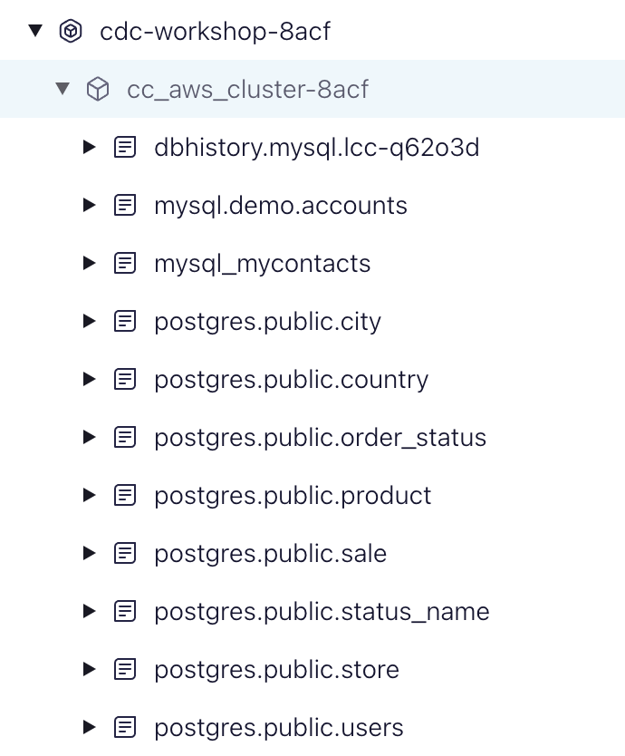

Transform the data into a new table:
What do we have in the original table:

```SQL
select * from `postgres.public.users`;
```

Create the new table:

```SQL
CREATE TABLE postgres_mycontacts(saluation STRING, firstname STRING,lastname STRING, email STRING);
```

Create the job:

```SQL
INSERT into postgres_mycontacts SELECT 'Mrs./Mr.', 'tdb', after[2], '' FROM `postgres.public.users`;
```

Check if events are in new table:

```SQL
select * from postgres_mycontacts;
```

Enrich with genAI. We use the mode from [2. Transform Oracle Data and Enrich with GenAI](dataprocessingREADME.md#Transform-Oracle-Data-and-Enrich-with-GenAI). :

```SQL
describe model cdcproductgenai_openai_model;
```

Create transformation table for PostGreSQL Products:

```SQL
CREATE TABLE postgres_products(NAME STRING, DESCRIPTION STRING, LIST_PRICE DECIMAL, SELLING_INFO STRING);
```

Check if model is still there:

```SQL
describe model cdcproductgenai_openai_model;
```

Then create the fill job, with model included.

```SQL
INSERT into postgres_products SELECT after[2], 'tbd',0, response FROM `postgres.public.product`, LATERAL TABLE(ML_PREDICT('cdcproductgenai_openai_model', after[2]));
```

Check the results: As you can imagine, the content generated by AI is largely fictional.

```SQL
select * from postgres_products;
```

> [!WARNING]
> Using OpenAI does incur costs, so please be mindful of how you design your tasks. This example is intended to demonstrate how easy it is to generate valuable content.


## 5. Join all transformed contacts and do de-duplication and masking

Now, we are finished with data processing and will now sink the data into AWS Services.
First do union all with contacts content and then with product content. Later we will do a de-duplication to have unique data.
Create Joined Table-Structure for contacts:

```SQL
CREATE TABLE all_contacts(saluation STRING, firstname STRING NOT NULL, lastname STRING NOT NULL, email STRING NOT NULL);
```

Create Joined Table-Structure for products:

```SQL
CREATE TABLE all_products(NAME STRING , DESCRIPTION STRING NOT NULL, LIST_PRICE DECIMAL NOT NULL, SELLING_INFO STRING NOT NULL);
```

Union all contacts:

```SQL
EXECUTE STATEMENT SET
BEGIN
  INSERT INTO all_contacts select * from mysql_mycontacts where saluation is not null and firstname is not null and lastname is not null and email is not null;
  INSERT INTO all_contacts select * from salesforce_mycontacts where saluation is not null and firstname is not null and lastname is not null and email is not null;
  INSERT INTO all_contacts select * from oracle_mycontacts where saluation is not null and firstname is not null and lastname is not null and email is not null;
END;
```

Check the results:

```SQL
select * from all_contacts where firstname='Suvad';
```

You will see, we do have duplicates: at least a duplicate with **Suvad**.

Union all products:

```SQL
EXECUTE STATEMENT SET
BEGIN
  INSERT INTO all_products select * from postgres_products where NAME is not null and DESCRIPTION is not null and LIST_PRICE is not null and SELLING_INFO is not null;
  INSERT INTO all_products select * from oracle_products where PRODUCT_NAME is not null and DESCRIPTION is not null and LIST_PRICE is not null and SELLING_INFO is not null;
END;
```

Check the results:

```SQL
select * from all_products;
```

Now we try Flink Actions. We will mask the email in all_contacts:
Go to data portal, choose the correct environment `cdc-workshop-xxxx` and then choose `all_contacts` data product. On the left side you see Action button, choose it. Click `Mask Fields` and Enter the fields and `confirm and run`.
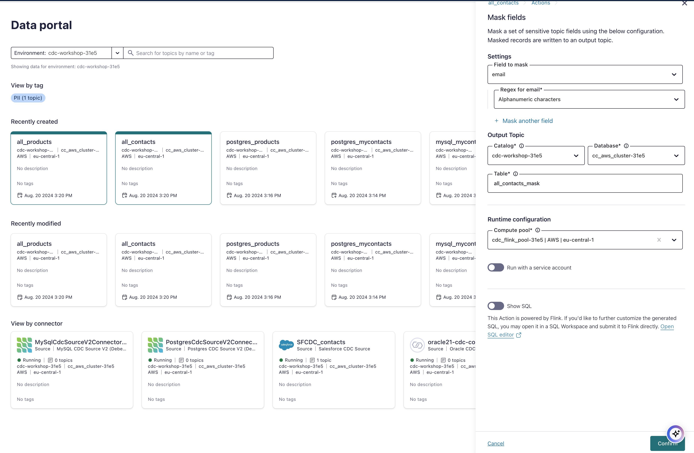

A new topic was created: `all_contacts_mask`
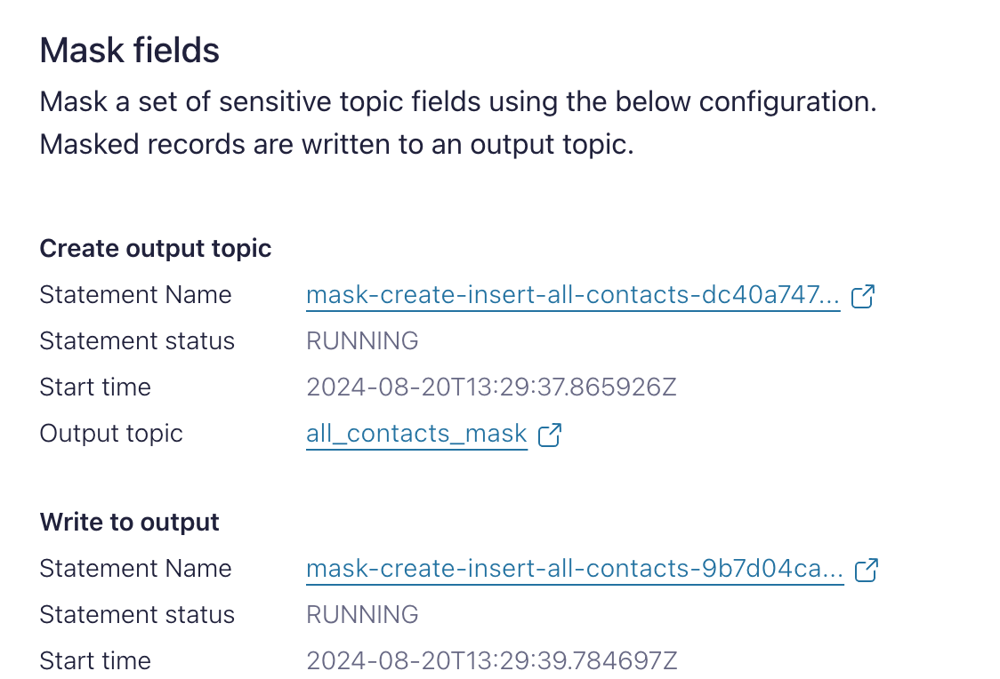

Check in FLINK SQL the results:

```SQL
select * from all_contacts_mask;
```

or use the topic viewer:
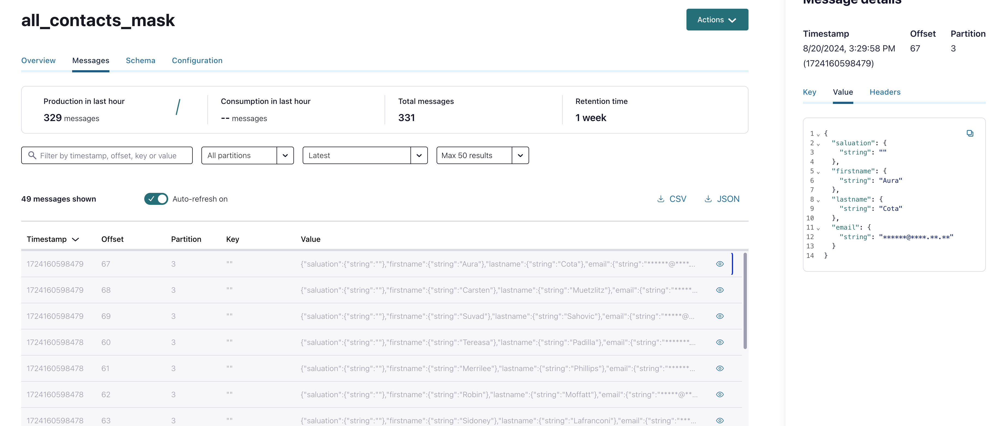 

Try to de-duplicate `all_products` or `all_contacts`. Do the same like for Masking with De-duplication Flink Action (over the Data Portal) know.

If successful you will see this output
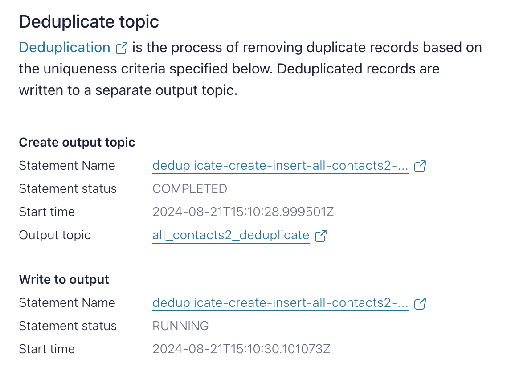 

Please have also a look on the Flink Throughput status window. You will see that a couple of CFUs are activated. If you see pending jobs it would be a good idea to increase the CFU Amount. Increase to 20. And you will see the pending jobs are know running.
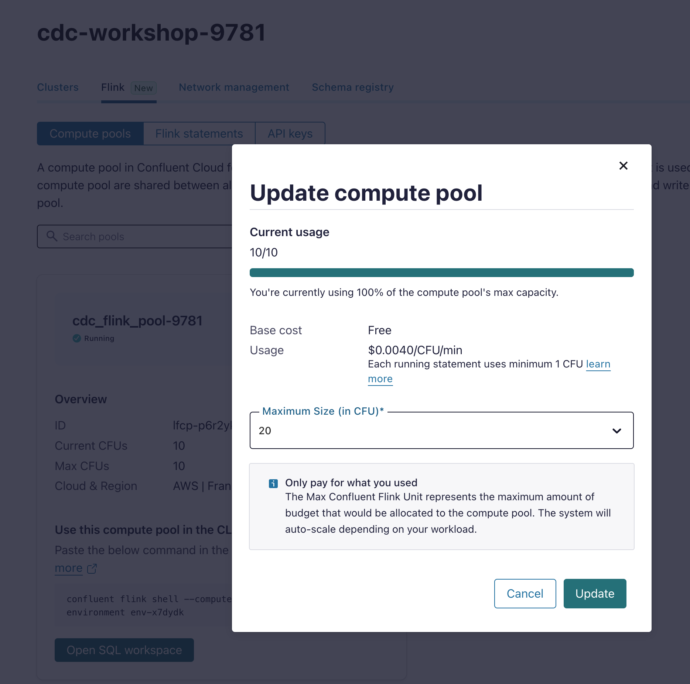

Check yourself, if your Flink Actions do what you expect. (Have a look into the Flink Statements section and look what the jobs do)

back to [Deployment-Steps Overview](../README.MD) or continue with Sink Cloud Services [S3](aws-s3/README.md)