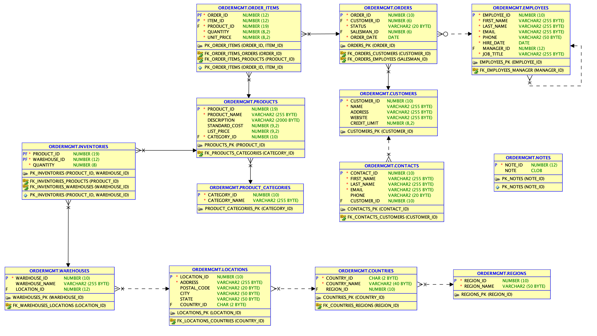

# Oracle DB Enterprise Edition running on AWS as docker container

I did prepare an AWS AMI with an Oracle 21c DB including all data, permissions etc. Have such an image is better to run a DB Service very fast within a compute service. This workshop is expecting that you have prepared such a image. To create this AMI you need to follow these [manual steps](manualstep.md) or ask Confluent for help.

## Prerequisites for this build

* Having an AWS Account, with AWS Key and Secret, see [manage access keys](https://docs.aws.amazon.com/IAM/latest/UserGuide/id_credentials_access-keys.html). My AWS access key has these permission policies aligned: AdministratorAccess, AmazonEC3FullAccess, AmazonS3FullAccess and AmazonRedshiftFullAccess
* having AWS compute key pair created (for the SSH Access) see [AWS docu](https://docs.aws.amazon.com/AWSEC2/latest/UserGuide/create-key-pairs.html)
* Having an AMI prepared with all the software documented in [manual step](manualstep.md). Ask Confluent to enable a correct AMI for you.
* terraform installed (I am running v.1.6.6)
* knowing your current Public IP Address, see [my IP](https://www.myip.com/) and the EGRESS IP List from Confluent cloud. This will be automatically added in `.aws_env`file.
* Accept the OTN License (for playing with Oracle), see [OTN License](https://www.oracle.com/downloads/licenses/standard-license.html)
* optional you could run SQL Developer and SQL*Plus on your desktop

## Deployment

Deploy the Oracle DB Service via terraform:

```bash
cd ../oracle21
source .aws_env
terraform init 
terraform plan
terraform apply
``` 

If you did deploy successfully with terraform you will get the following output:

```bash
# Apply complete! Resources: 4 added, 0 changed, 0 destroyed.
# Outputs:
# A00_instance_details = {
#  "ami" = "
#  ...
# A01_PUBLICIP = "x.x.x.x"
# A02_ORACLESERVERNAME = "ec2-x-x-x-x.eu-central-1.compute.amazonaws.com"
# A03_SSH = "SSH  Access: ssh -i ~/keys/cmawskeycdcworkshop.pem ec2-user@18.195.50.248 "
# A04_OracleAccess = "sqlplus sys/confluent123@ORCLCDB as sysdba or sqlplus sys/confluent123@ORCLPDB1 as sysdba or sqlplus ordermgmt/kafka@ORCLPDB1  # Port:1521  HOST:x.x.x.x"
```

It takes a little while till everything is up and running in aws compute instance. The database has to start etc. 
Login into cloud compute instance via ssh and check status:

```bash 
ssh -i ~/keys/cmawskeycdcworkshop.pem ec2-user@x.x.x.x
echo $LD_LIBRARY_PATH
echo $PATH
sudo docker ps
# CONTAINER ID     IMAGE                       COMMAND                  CREATED       ...
# 3c8c05402956     oracle/database:21.3.0-ee   "/bin/sh -c 'exec $O…"   2 month ago   ...
```

In the compute service after login via ssh: `ssh -i ~/keys/cmawskeycdcworkshop.pem ec2-user@PUBIP` you use SQL*Plus

* `sqlplus sys/confluent123@ORCLCDB as sysdba` or 
* `sqlplus sys/confluent123@ORCLPDB1 as sysdba` or 
* `sqlplus ordermgmt/kafka@ORCLPDB1`

Port is always 1521 and HOST is the public IP address of the compute service.

If docker ps gives you a result (see above), than your DB is running. You need not to execute the next 1. and 2.

1. The Oracle DB should run as container. If not do the following:

```bash
export CONTAINERID=$(sudo docker ps -a | awk  'NR==2 {print $1}')
sudo docker start $CONTAINERID
```

2. If no oracle21c docker container is running, start it by creating a new container

```bash
docker run \
--name oracle21c \
-p 1521:1521 \
-p 5500:5500 \
-e ORACLE_PDB=ORCLPDB1 \
-e ORACLE_PWD=confluent123 \
-e ORACLE_MEM=4000 \
-v /opt/oracle/oradata \
-d oracle/database:21.3.0-ee
```

With a running database you should have to access now also SQL Developer (on your desktop) and sqlplus (on aws compute or Desktop).

```bash
# AWS Compute via SSH login
ssh -i ~/keys/cmawskeycdcworkshop.pem ec2-user@x.x.x.x
# try sysdba to CDB
sqlplus sys/confluent123@ORCLCDB as sysdba 
SQL> show pdbs;
SQL> exit;
# try sysdba to PDB
sqlplus sys/confluent123@ORCLPDB1 as sysdba
SQL> show pdbs;
# try local user in PDB
SQL> connect ordermgmt/kafka@ORCLPDB1
SQL> set lines 200   
SQL> select * from cat;
SQL> exit;
```

From your desktop use SQL Developer or SQL*Plus with Easy Connect (this is optional):

```bash
# try sysdba to CDB with easy connect
sqlplus sys/confluent123@//x.x.x.x:1521/ORCLCDB as sysdba
# try sysdba to PDB
sqlplus sys/confluent123@//x.x.x.x:1521/ORCLPDB1 as sysdba
# try local user in PDB
sqlplus ordermgmt/kafka@//x.x.x.x:1521/ORCLPDB1
```

We do have the following data model in Oracle21c ORCLPDB1 implemented. All these tables get CDC-ed by the Oracle CDC Source Connector.


back to [Deployment-Steps Overview](../README.MD) or continue with the [Oracle CDC Connector](../ccloud-source-oracle-cdc-connector/README.md)