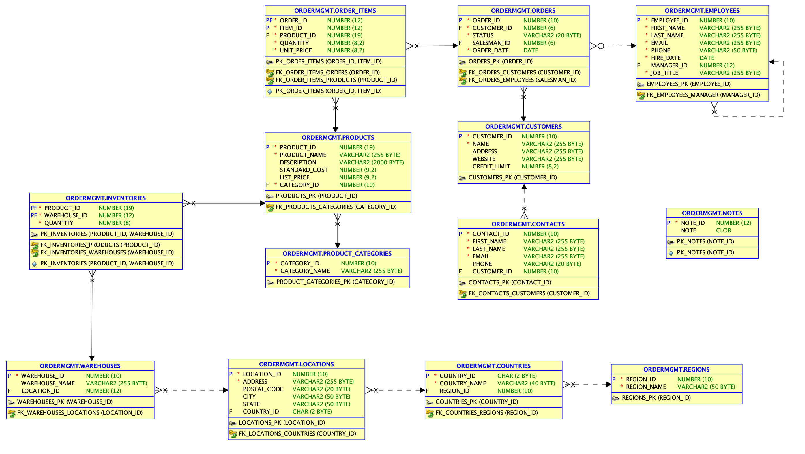

# Oracle DB XE Edition running on AWS as docker container

I did prepare an AWS Compute Service running with an Oracle 21c XE Docker image. So, there are no license fees.

# Contents

[1. Prerequisites for this build](README.md#Prerequisites-for-this-build)

[2. Deployment](README.md#Deployment)


## Prerequisites for this build

Reminder: this section you run already during the  preparation

* (from preparation) Having an AWS Account, with AWS Key and Secret, see [manage access keys](https://docs.aws.amazon.com/IAM/latest/UserGuide/id_credentials_access-keys.html). My AWS access key has these permission policies aligned: AdministratorAccess, AmazonEC3FullAccess, AmazonS3FullAccess and AmazonRedshiftFullAccess
* (from preparation) having AWS compute key pair created (for the SSH Access) see [AWS docu](https://docs.aws.amazon.com/AWSEC2/latest/UserGuide/create-key-pairs.html)
* (from preparation) terraform installed (I am running v.1.6.6)
* (this is generated automatically ) knowing your current Public IP Address, see [my IP](https://www.myip.com/) and the EGRESS IP List from Confluent cloud. This will be automatically added in `.aws_env`file. It will happen that MYIP was not correct generated, so please change if necessary.
* (optional for Oracle XE) Accept the OTN License (for playing with Oracle), see [OTN License](https://www.oracle.com/downloads/licenses/standard-license.html)
* (optional) you could run SQL Developer and SQL*Plus on your desktop

## Deployment

Deploy the Oracle DB Service via terraform:

```bash
cd ../oraclexe21c
source .aws_env
terraform init 
terraform plan
terraform apply
```

If you did deploy successfully with terraform you will get the following output:

```bash
# Apply complete! Resources: 4 added, 0 changed, 0 destroyed.
# Outputs:
# A00_instance_details = {
#  "ami" = "
#  ...
# A01_PUBLICIP = "x.x.x.x"
# A02_ORACLESERVERNAME = "ec2-x-x-x-x.eu-central-1.compute.amazonaws.com"
# A03_SSH = "SSH  Access: ssh -i ~/keys/cmawskeycdcworkshop.pem ec2-user@18.195.50.248 "
# A04_OracleAccess = "sqlplus sys/confluent123@XE as sysdba or sqlplus sys/confluent123@XEPDB1 as sysdba or sqlplus ordermgmt/kafka@XEPDB1  # Port:1521  HOST:x.x.x.x"
```

It takes a little while till everything is up and running in aws compute instance. The database has to start etc.
Please **write down the IP**, we need it later.
Login into cloud compute instance via ssh and check status:

```bash
ssh -i ~/keys/cmawskeycdcworkshop.pem ec2-user@x.x.x.x
# first check if instance is finished with preparation, if you see finish, then preparation should be complete
sudo tail -f /var/log/cloud-init-output.log 

# If you find an error invalid reference format, then aws compute has problem to pull the oracle image from container-registry.oracle.com/database/express:21.3.0-xe

# The database is ready if you see something like this
#Cloud-init v. 19.3-46.amzn2.0.2 finished at Sun, 15 Sep 2024 10:35:06 +0000. Datasource DataSourceEc2.  Up 424.02 seconds
CTRL+C to leave tail

# Execute into container
cd docker
sudo docker exec -it oracle21c /bin/bash
# Check if oracle Processes run XE_xxxx_XE
ps -ef | grep ora

# Check status listener
lsnrctl status

# Connect as sysdba
sqlplus sys/confluent123@XE as sysdba
SQL> show pdbs
# Show Archive Log enabled
SQL> archive log list;
SQL> connect ordermgmt/kafka@XEPDB1
SQL> select * from cat;
SQL> exit;
exit;
```

Port is always 1521 and HOST is the public IP address of the compute service.

We do have the following data model in Oracle21c XEPDB1 implemented. All these tables get CDC-ed by the Oracle CDC Source Connector.


Currently the database is not under heavy load. Without a connector running to Oracle DB the workload of the compute service is quite low.


back to [Deployment-Steps Overview](../README.md) or continue with the [Oracle CDC Connector](../ccloud-source-oracle-cdc-connector/README.md)
