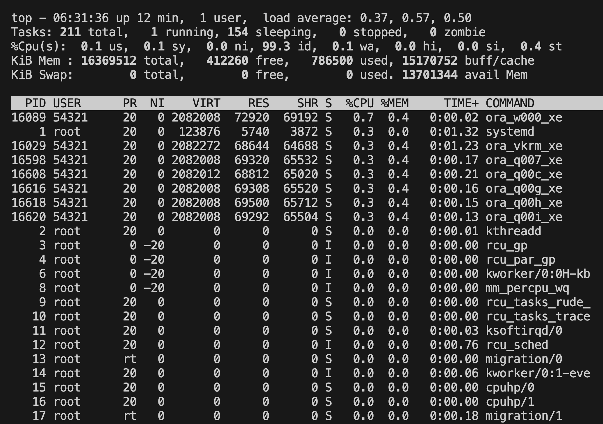

# Oracle DB XE Edition running on Azure as docker container

I did prepare an Azure Compute Service running with an Oracle 21c XE Docker image. So, there are no license fees, because XE is a free edition of Oracle. Typically Oracle CDC Connector from Confluent need an Enterprise Edition.
CDC is preconfigured, so that everything mentioned [here](https://docs.confluent.io/cloud/current/connectors/cc-oracle-cdc-source/oracle-cdc-setup-includes/prereqs-validation.html#oracle-database-prerequisites-for-oracle-cdc-source-connector-for-product) is already implemented at the Oracle DB level.
You just to deploy the Oracle DB Compute service, and you can start playing.

## Contents

[1. Prerequisites for this build](README.md#Prerequisites-for-this-build)

[2. Deployment](README.md#Deployment)


## Prerequisites for this build

Reminder: this section you run already during the preparation

* Having Azure Setup finished [see ](../README.md#prerequisite)
* (optional for Oracle XE) Accept the OTN License (for playing with Oracle), see [OTN License](https://www.oracle.com/downloads/licenses/standard-license.html)
* (optional) you could run SQL Developer and SQL*Plus on your desktop otherwise login to SSH Console in [Google Cloud Console for COmpute Engine](https://console.cloud.google.com/compute/instances)

## Deployment

Deploy the Oracle DB Service via terraform:

```bash
cd ../oraclexe21c
# First login to Azure. Terraform need this for authentication
az login
source .azure_env
terraform init 
terraform plan
terraform apply
```

If you did deploy successfully with terraform you will get the following output:

```bash
# A01_resource_group_name = "rg-cdc-workshop-renewed-kangaroo"
# A02_StorageAccount = <sensitive>
# A03_PUBLICIP = "40.68.8.191"
# A04_SSH = "ssh -i ${TF_VAR_publicsshkey:0:(-4)} azureadmin@X.X.X.X"
# A05_OracleAccess = "sqlplus sys/confluent123@XE as sysdba or sqlplus sys/confluent123@XEPDB1 as sysdba or sqlplus ordermgmt/kafka@XEPDB1  Port:1521  HOST:X.X.X.X"
```

It takes a little while till everything is up and running in azure compute instance. All the updates and the database has to start etc.
Please **write down the Public IP**, we need it later.
Login into cloud compute instance via ssh.

```bash
ssh -i ${TF_VAR_publicsshkey:0:(-4)} azureadmin@X.X.X.X
sudo tail -f /var/log/cloud-init-output.log
# if you see Cloud-init v. 23.4-7.el8_10 finished at Wed, 09 Oct 2024 07:37:22 +0000. Datasource DataSourceAzure [seed=/dev/sr0].  Up 559.21 seconds

# Check the disk size, if there is still enough space, see utils/instance.sh script for volume sizing
sudo df -Th
sudo lsblk

# Status container
sudo docker container ls
# Execute into container
sudo docker exec -it oracle21c /bin/bash
# Check if oracle Processes run XE_xxxx_XE
ps -ef | grep ora

# Check status listener
lsnrctl status

# Connect as sysdba
sqlplus sys/confluent123@XE as sysdba
SQL> show pdbs
# Show Archive Log enabled
SQL> archive log list;
# Database log mode              **Archive Mode**
# Automatic archival             **Enabled**
# Archive destination            /opt/oracle/homes/OraDBHome21cXE/dbs/arch
# Oldest online log sequence     2
# Next log sequence to archive   4
# Current log sequence           4
SQL> connect ordermgmt/kafka@XEPDB1
SQL> select * from cat;
SQL> exit;
exit;
exit;
```

Port is always 1521 and HOST is the public IP address of the compute service.

We do have the following data model in Oracle21c XEPDB1 implemented. All these tables get CDC-ed by the Oracle CDC Source Connector.


Currently the database is not under heavy load. Without a connector running to Oracle DB the workload of the compute service is quite low.


You can now check if all Database Privileges are set correctly, [Validate DB Privileges for CDC Connector](Validate_DB_privs.md)

Before starting the CDC Connector, you may want to investigate into [long running transactions](LongRunningTransactions.md).

back to [Deployment-Steps Overview](../README.md) or continue with the [Oracle CDC Connector](../ccloud-source-oracle-cdc-connector/README.md)
