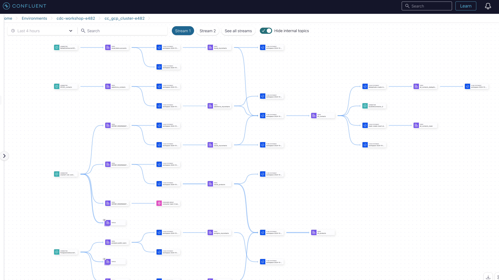

# Confluent ATG CDC-Hands-on-Workshop (GCP deployment)

You have chosen GCP. We will conduct the entire workshop exclusively using GCP services.


## Content

[1. Prerequisite](README.md#Prerequisite)

[2. Start your Deployment](README.md#Start-your-Deployment)

[3. Destroy Deployment Cloud Services for Hands-on](README.md#Destroy-Deployment-Cloud-Services-for-Hands-on)

## Prerequisite

> [!CAUTION]
> The workshop was tested with MacBook Pro on Intel and on Apple Silicon. If you run Apple Mac Silicon processor please [prepare](https://medium.com/@immanoj42/terraform-template-v2-2-0-does-not-have-a-package-available-mac-m1-m2-2b12c6281ea), so that your terraform execution is working fine.

Main tools:

* terraform
* confluent cli
* google sdk and cli `gcloud`

The preparations are very important and need your attention.

* Confluent Cloud account([Sign-up](https://www.confluent.io/confluent-cloud/tryfree/)) and [Confluent Cloud API Key](https://www.confluent.io/blog/confluent-terraform-provider-intro/#api-key). 
* Set up Google
   - To use Google Cloud services, you need to have a Google Cloud Platform (GCP) account. If you don’t have one, you can sign up at [Google Cloud Console](https://console.cloud.google.com/).
   - Installing Google Cloud SDK `gcloud`. The Google Cloud SDK, also known as `gcloud`, is a command-line tool that provides access to GCP services. Install it on your local machine by following the instructions in the [Google Cloud SDK documentation](https://cloud.google.com/sdk/docs/install).
   - After installing gcloud, authenticate it with your Google Cloud account by running `gcloud auth login`. This step ensures that you have the necessary credentials to interact with your GCP projects and resources.
   - Configure `gcloud` with your default project and region settings using `gcloud config set project PROJECT_ID` and `gcloud config set compute/region REGION` to make sure your Terraform configurations align with your target environment. Check with `gcloud config configurations list`and compare if config is correct
   - To interact with GCP using Terraform, you should create a service account with appropriate permissions. This service account will be used for authentication when running Terraform. You can create a service account in the Google Cloud Console and download a JSON key file. Do it in the [console](https://console.cloud.google.com/iam-admin/serviceaccounts/create). We add a couple of roles: Compute Admin, Compute Storage Admin, Compute Network Admin, Bigquery Admin, Storage Admin and generate keys. This will download the json file. add the complete path with file name to `gcp_credentials` in file `.account`
* Install terraform. Terraform is not bundled with gcloud, so you need to install it separately. You can download Terraform from the official website and follow the [installation instructions](https://developer.hashicorp.com/terraform/install).
* Salesforce account and configuration for using CDC. Create a Salesforce Developer account [Sign-up](https://developer.salesforce.com/signup). Configure Salesforce CDC, follow [my setup with screenshots](ccloud-source-salesforce-cdc-connector/setup_salesforce.md) or use [Confluent Documentation](https://docs.confluent.io/cloud/current/connectors/cc-salesforce-source-cdc.html#quick-start)
* (optional) openAI Account ([Sign-up](https://platform.openai.com/signup/)) and [API Key](https://platform.openai.com/docs/quickstart/create-and-export-an-api-key), we need this to produce product data

create a file for all your credentials used in this workshop and store it in `terraform/gcp/.accounts`:

```bash
cd confluent-cdc-workshop/terraform/gcp/
echo "# Confluent Cloud
export TF_VAR_confluent_cloud_api_key=\"KEY\"
export TF_VAR_confluent_cloud_api_secret=\"SECRET\"
export TF_VAR_cc_cloud_provider=\"GCP\"
export TF_VAR_cc_cloud_region=\"europe-west1\"
export TF_VAR_cc_env_name=\"cdc-workshop\"
export TF_VAR_cc_cluster_name=\"cc_gcp_cluster\"
export TF_VAR_sr_package=\"ADVANCED\"
# GCP Cloud
export gcp_credentials=\"~/keys/gcp_cdc_workshop.json\"
export project_id=\"<ProjectName>\"
export project_zone=\"europe-west1-c\"
export service_account_name=\"<Service Account Name>\"
export owner_email=\"cmutzlitz_confluent_io\"
export vm_user=\"cmutzlitz_confluent_io\"
export bucket_name=\"cdc-workshop\"
# Salesforce
export sf_user=\"YOUR EMAIL\"
export sf_password=\"YOUR PW\"
export sf_password_token=\"YOUR TOKEN\"
export sf_consumer_key=\"YOUR CONSUMER KEY\"
export sf_consumer_secret=\"YOUR CONSUMER SECRET\"
export sf_cdc_name=\"ContactChangeEvent\"
# openAI
export OPENAI_API_KEY=\"sk-YOURKEY\"" > .accounts
```

**Parameter description:**
* TF_VAR_confluent_cloud_api_key: Confluent Cloud Cloud Key (I run it as OrgAdmin)
* TF_VAR_confluent_cloud_api_secret: Confluent Cloud Cloud KeySecret
* TF_VAR_cc_cloud_provider: Cloud Provider here GCP
* TF_VAR_cc_cloud_region: Cloud Provider region here europe-west1
* TF_VAR_cc_env_name: Name of the environment in Confluent Cloud
* TF_VAR_cc_cluster_name: Name of the Confluent Cloud Cluster
* TF_VAR_sr_package: We will use the Advanced Governance package, value is "ADVANCED"
* gcp_credentials is the credential file
* project_id of the gcp project (the name, not the ID)
* project_zone "europe-west1-c". This is output after login to gcloud
* service_account_name you created for this project
* owner_email , this username like **cmutzlitz_confluent_io** of GCP user with underscores of my registered email **cmutzlitz@confluent.io**
* vm_user:  e.g. my email of my account will be used as ios user in vm in this style **cmutzlitz_confluent_io**
* bucket_name: gcp storage bucket name here cdc-workshop
* sf_user: Your Salesforce user
* sf_password: Your Salesforce password
* sf_password_token: Your Salesforce Password token
* sf_consumer_key: Your CONSUMER Key
* sf_consumer_secret: YOUR CONSUMER SECRET
* sf_cdc_name: ContactChangeEvent if you choosed the CDC Object Contacts.
* (optional) OPENAI_API_KEY: Your openAI API Key

If the `.accounts` file is ready, then preparation is finished. Now everything is more or less easy to execute. We will use terraform only.

## 1. Start your Deployment

How to deploy the cloud resources:

1. Start with Confluent Cluster deployment:
   Please follow this [guide](ccloud-cluster/README.md). Use the Confluent cloud Console, to check what was deployed.
2. Deploy the Oracle 21c DB service in GCP Compute
   Please follow this [guide](oraclexe21c/README.md). The service need a while to get up and running.
3. Deploy all Oracle CDC Source Connector
   Please follow this [guide](ccloud-source-oracle-cdc-connector/README.md). The creation of the Oracle CDC Connector takes a couple of minutes. Please check in Confluent Cloud Console the status.
4. Deploy the other DB services in GCP (mysql and postgreSQL)
   Please follow the instruction in this [guide](mysql_postgres/Readme.md).
5. Deploy mysql CDC Source Connector
   Follow the instructions in [guide](ccloud-source-mysql-cdc-connector/README.md)
6. Deploy postgreSQL CDC Source Connector
   Follow the instructions in [guide](ccloud-source-postgresql-cdc-connector/README.md)
7. Deploy Salesforce CDC Source Connectors
   SalesForce CDC Connector Deployment instructions are find [here](ccloud-source-salesforce-cdc-connector/README.md)
8. Data processing with Flink SQL
   This is the main part of the Hands-on Workshop. We will transform, mask and more within the data processing part. Instruction Guide is [here](dataprocessingREADME.md).
9. Sink new data to Sink services with deployed Sink Connectors (Storage, Bigquery). We will start with Storage. Follow [Storage Sink Connector setup](gcp-storage/README.md). 
10. Then the setup for [BigQuery Sink Connector](), Coming soon.
11. (Optional): Do advanced stuff: Let the data flow by implementing database record generation, coming soon
12. (optional): Migrate Connectors, this is very important to move self-managed connectors to fully-managed connectors, and also for replay. coming soon

If you did implement all components then we run 5 Connectors (4 Source, 1 Sink). Bigquery connector coming soon.


All Labs are implemented. In Confluent **Stream Lineage** we see now what is happening in our cluster and how the data is flowing. Filter by hours. Without bigquery connector.


If you would like to check now our data products, please click on the Data Portal and choose the correct environment **cdc-workshop-xxx**. Then you see all the products we did implement. Without bigquery connector.


## Destroy Deployment Cloud Services for Hands-on

Destroy each component step by step:

```bash
cd confluent-cdc-workshop/terraform/gcp
bash ./00_shutdown_services.sh
# You need to enter YES for each deployed resources, the whole exercise does take a while
```

> [!IMPORTANT]
> Please check in Google Cloud console and Confluent Cloud Console if all services are really deleted. Do not forget, Cloud costs money. If you left a service running, it will generate  costs. If some components are not deleted by terraform, delete it please manually or run again `terraform destroy` for this component.

Good job. The **Hands-on Workshop within GCP is FINISHED**.

Back to [Main-Overview Page](../../README.md)
