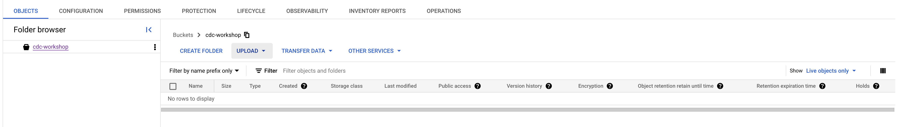

# Deploy GCP Storage Sink Connector

Deploy the Storage Sink Connector

```bash
# Deploy connector
cd gcp/ccloud-sink-s3-connector
source .ccloud_env
terraform init
terraform plan
terraform apply
```

Terraform will output after deployment:

```bash
# Apply complete! Resources: 1 added, 0 changed, 0 destroyed.
# Outputs:
# A00_Storage_SINK_Connector = "Login into your Confluent Cloud Console and check in your cluster if Storage Sink Connector is running"
```


> [!CAUTION]
> It could be that connector failed. In my case because of input.data.format and output.data.format. If you edit the parameters in config viewer of the connector and apply changes. The connector is running as normal. (I will evaluate this behaviour in detail.)

We will sink `all_products` to Google Storage.

Default offset setting is `Jump back to the earliest message per topic (default)` but you can start where you want. See [manage offset for Sink Connectors](https://docs.confluent.io/cloud/current/connectors/offsets.html?ajs_aid=5ed44563-a71c-44cb-86d1-9ea6632b3d06&ajs_uid=55951#custom-offsets-sink-proc).

After Storage Connector deployment you will see no data in Storage bucket.

Try to insert a new record via [Google Cloud Console for Compute Engine](https://console.cloud.google.com/compute/instances)  and SSH connection:


If you sink all_products:

```bash
# INSERT if you sink all_products
sudo docker exec -it postgres psql -U postgres-user -d customers
customers=# select * from product;
# product_id |    name     
#------------+-------------
#          1 | Product 1
# ...
#         100| Product 100
customers=# INSERT INTO PRODUCT VALUES (201, 'MacBook Pro');
# INSERT 0 1
customers=# INSERT INTO PRODUCT VALUES (202, 'VW ID.3');
# INSERT 0 1
customers=# INSERT INTO PRODUCT VALUES (203, 'Apple Mouse');
# INSERT 0 1
customers=# INSERT INTO PRODUCT VALUES (204, 'Apple iPphone');
# INSERT 0 1
customers-# \q
exit
```

(optional) if you sink all_contacts:

```bash
# INSERT if you sink all_contacts
sudo docker exec mysql mysql -umysqluser -pmysqlpw demo -e "INSERT INTO accounts (account_id, first_name, last_name, email, phone, address, country)
VALUES ('a100', 'Suvad', 'Sahovic', 'suvad@cofluent.io', '+49 30 9393993', '13595 Berlin', 'Germany');"
sudo docker exec mysql mysql -umysqluser -pmysqlpw demo -e "INSERT INTO accounts (account_id, first_name, last_name, email, phone, address, country)
VALUES ('a101', 'Suvad', 'Sahovic', 'suvad@cofluent.io', '+49 30 9393993', '13595 Berlin', 'Germany');"
sudo docker exec mysql mysql -umysqluser -pmysqlpw demo -e "INSERT INTO accounts (account_id, first_name, last_name, email, phone, address, country)
VALUES ('a102', 'Suvad', 'Sahovic', 'suvad@cofluent.io', '+49 30 9393993', '13595 Berlin', 'Germany');"
sudo docker exec mysql mysql -umysqluser -pmysqlpw demo -e "INSERT INTO accounts (account_id, first_name, last_name, email, phone, address, country)
VALUES ('a103', 'Suvad', 'Sahovic', 'suvad@cofluent.io', '+49 30 9393993', '13595 Berlin', 'Germany');"
sudo docker exec mysql mysql -umysqluser -pmysqlpw demo -e "INSERT INTO accounts (account_id, first_name, last_name, email, phone, address, country)
VALUES ('a104', 'Suvad', 'Sahovic', 'suvad@cofluent.io', '+49 30 9393993', '13595 Berlin', 'Germany');"
sudo docker exec mysql mysql -umysqluser -pmysqlpw demo -e "INSERT INTO accounts (account_id, first_name, last_name, email, phone, address, country)
VALUES ('a105', 'Suvad', 'Sahovic', 'suvad@cofluent.io', '+49 30 9393993', '13595 Berlin', 'Germany');"
sudo docker exec mysql mysql -umysqluser -pmysqlpw demo -e "select * from accounts;"
exit
```

New product is flowing into `all_products` topic. But still nothing visible in Storage. It takes a while and then you will see the avro file. This is because of `"time.interval": "HOURLY"` and `"flush.size": "1000"`. If **flush_size** setting of 1000 and the partitioner is set to **Hourly**. 500 records arrive at one partition from 2:00pm to 3:00pm. At 3:00pm, an additional 5 records arrive at the partition. You will see 500 records in storage at 3:00pm. We do sez rotation for 600000ms, which earliest in 10 minutes you see data. See [rotation setup](https://docs.confluent.io/cloud/current/connectors/cc-gcs-sink.html#scheduled-rotation)


back to [Deployment-Steps Overview](../README.md) or continue with Sink Cloud Services [gcp-bigquerry/](../gcp-bigquerry//README.md)