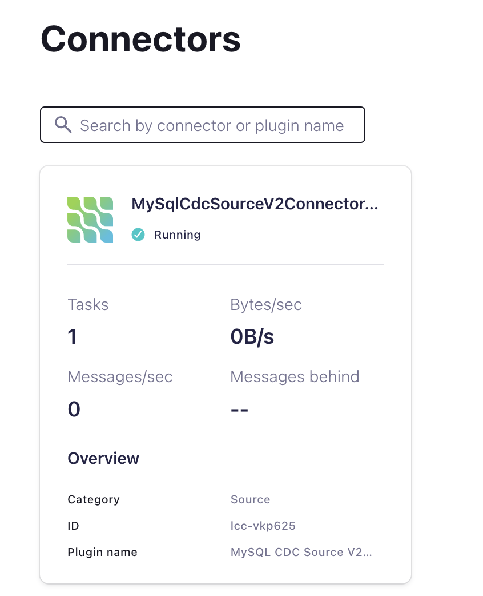
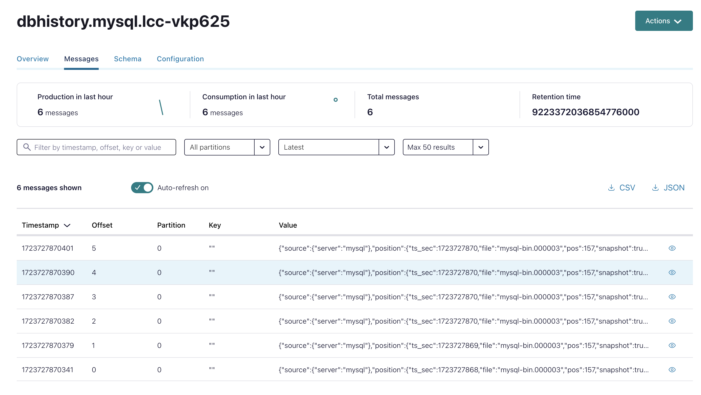
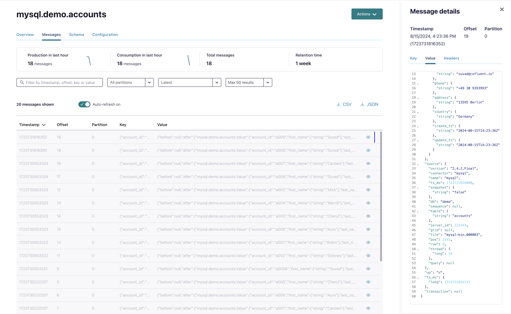

# Deploy MySQL CDC Source V2 (Debezium) connector

Now, we will deploy the mySQL CDC Connector via terraform:

```bash
cd ../ccloud-source-mysql-cdc-connector
source .ccloud_env
terraform init
terraform plan
terraform apply
```

Terraform will output after deployment:

```bash
# Apply complete! Resources: 1 added, 0 changed, 0 destroyed.
# Outputs:
# A00_MYSQL_CDC_Connector = "Login into your Confluent Cloud Console and check in your cluster if mysql CDC Source Connector is running"
```



Terraform need a while to close. But the connector is working already. You can check via Confluent Cloud UI. It could take 5-10 minutes till terraform outputs.
The connector will create a new topic `dbhistory.<topic.prefix>.<connect-id> in my case dbhistory.mysql.lcc-vkp625`.  This topic stores the history of what happened in the mysql DB. The internal database schema history topic is for connector use only, and it is not intended for direct use by consuming applications.



When a Debezium MySQL CDC connector is first started, it performs an initial consistent snapshot of your database. This snapshot enables the connector to establish a baseline for the current state of the database. Debezium can use different modes when it runs a snapshot. The snapshot mode is determined by the `snapshot.mode` configuration property. The default value of the property is **initial**, which we use as well.

The connector is configured to CDC table Accounts see `"table.include.list" = "demo.accounts"`. For this DB Table a so called change topic will be created with `<topic.prefix>.<database>.<table-name>` in my case `mysql.demo.accounts`.

First the current db record-set will be produced by doing a snapshot. Afterwards all INSERT, UPDATE, DELETE events will captured based on the change in source database.

Both topics (history and change) are created automatically.

Try to insert a new record via  [Google Cloud Console for Compute Engine](https://console.cloud.google.com/compute/instances) and SSH connection:

```bash
# INSERT twice the same record, we will do later de-duplication
sudo docker exec mysql mysql -umysqluser -pmysqlpw demo -e "INSERT INTO accounts (account_id, first_name, last_name, email, phone, address, country)
VALUES ('a009', 'Suvad', 'Sahovic', 'suvad@cofluent.io', '+49 30 9393993', '13595 Berlin', 'Germany');"
#Output: 
#mysql: [Warning] Using a password on the command line interface can be insecure.
sudo docker exec mysql mysql -umysqluser -pmysqlpw demo -e "INSERT INTO accounts (account_id, first_name, last_name, email, phone, address, country)
VALUES ('a010', 'Suvad', 'Sahovic', 'suvad@cofluent.io', '+49 30 9393993', '13595 Berlin', 'Germany');"
# Just ignore it
# check if inserted
sudo docker exec mysql mysql -umysqluser -pmysqlpw demo -e "select * from accounts;"
```

Try to find this record in Confluent Cloud console topic viewer.


back to [Deployment-Steps Overview](../README.md) or continue with the [Setup of PostGreSQL CDC Connector](../ccloud-source-postgresql-cdc-connector/README.md)