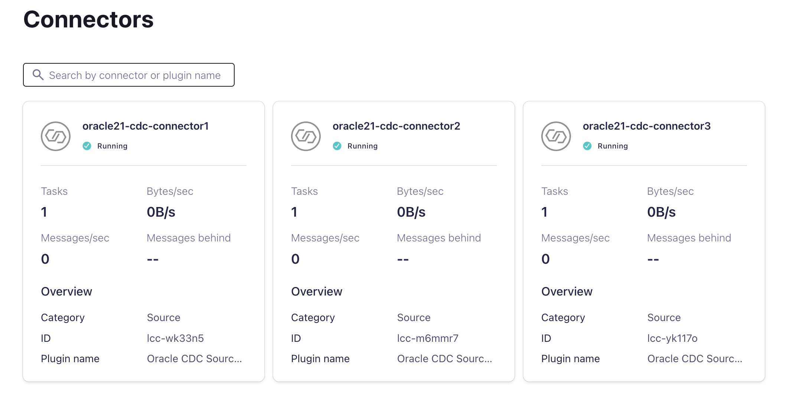
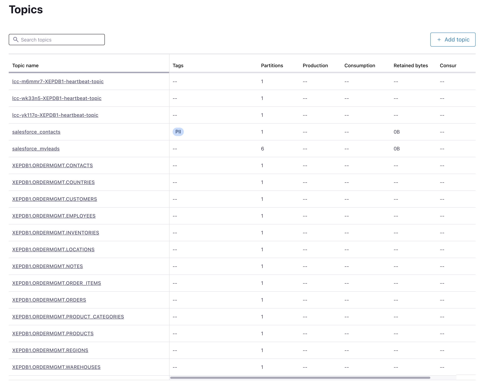
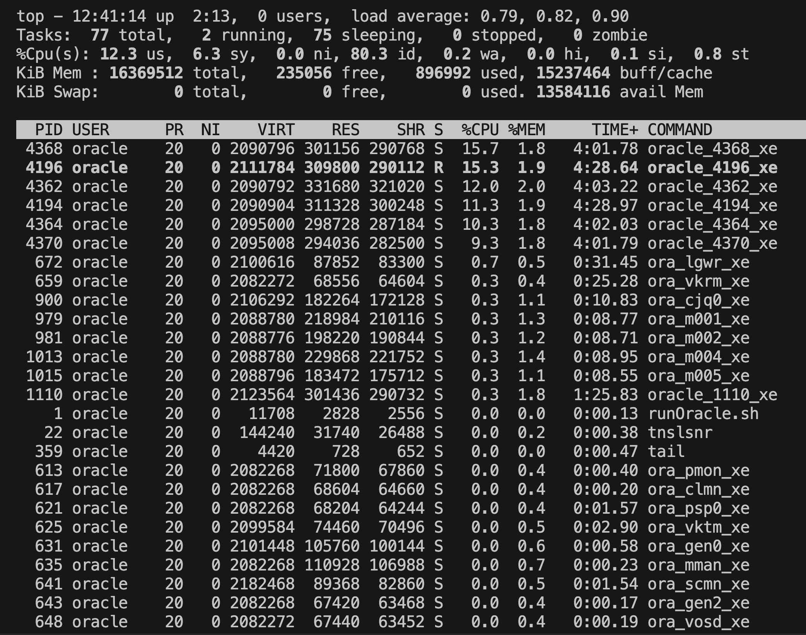
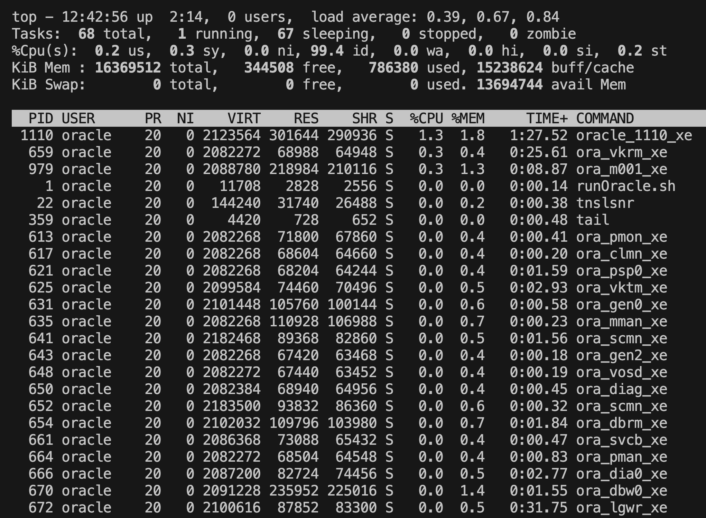

# Scalability for higher workloads, tuning tips, safe network bytes

Content:

# Table of Contents
1. [Scale with more than one Connector per database](#Scale-with-more-than-one-Connector-per-database)
2. [General tunings hints](#General-tunings-hints)

#  Scale with more than one Connector per database

This is a common scenario for customers who require more than 10 MB/s of throughput. It’s important to understand that the total throughput of the connectors largely depends on the LogMiner API (about 80%). Therefore, if LogMiner is slow, the connector's performance will be affected as well.

In this exercise, we will set up three CDC Source Connectors on the same database (PDB). I will demonstrate how this setup increases the workload on the database. Ultimately, it is up to you to decide how to design the system. Do you want to put more load on the database to achieve higher throughput on the connector side, especially if your LogMiner is performing efficiently? Let’s explore what happens when you run three connectors on the database side.

## Deploy Connectors

We expect that the Confluent Cloud cluster and the Database Service is running.
Run terraform

```bash
source ../.ccloud_env 
terraform init
terraform plan
terraform apply
```

Three connectors should now run.


These connectors created in total during the snaphot all table topics and the connector internal heartbeat tables.


## Check DB Workload

In the first phase the connector we do a snapshot, so an initial load of rows in the mentioned tables regex pattern property (table.inclusion.regex).
When doing now a change in the database, then the connectors will start to read the redolog in parallel. The connector will use the logminer API and search for changes. Each connector will read the `v$logmnr_contents view by starting each a new logmnr session` . This means each connector will read the same data as all the others. We will run three fully table scans on the changed data stored in the redo file (or achived logs). Let's see what is happing now.

The connector will create three redolog topics. Each connector will filter only the change data from table.inclusion.regex property.


Change database:

```bash
ssh -i ~/keys/cmawskeycdcworkshop.pem ec2-user@PUBIP
docker exec -it oracle21c /bin/bash
sqlplus ordermgmt/kafka@XEPDB1
# First update products in Connector 1
SQL> update products set list_price = list_price +1; 
SQL> commit;
# Second update customers in Connector 2
SQL> update customers set credit_limit = credit_limit * 1.1; 
SQL> commit;
# Third insert a new region Connector 3
SQL> INSERT into REGIONS values (5, 'TEST Region'); 
SQL> INSERT into REGIONS values (6, 'TEST Region'); 
SQL> INSERT into REGIONS values (7, 'TEST Region'); 
SQL> INSERT into REGIONS values (8, 'TEST Region'); 
SQL> commit;
SQL> exit;
exit;
```

We can compare the workload on the Oracle Instance with top.

With 3 Connectors: 12.3 % of CPU is used with 896992 Bytes Memory used


Compared without the connectors: 0.2 % of used CPU, with 786380 Bytes used Memory.


Image you run 20 connectors on one database, with heavy DB changes in background.
Please discuss your decision with your DBA.

## Destroy 3 Connnectors

Please run this terraform:

```bash
source ../.ccloud_env 
terraform destroy
```

# General tunings hints

To make the connector faster you can increase the tasks and tune the producer.

Producer tuning is believed to be the most effective one we can do to get better performance for source connectors. The default batchsize value is 16384 Bytes which is probably too small. Please also make sure you have either `connector.client.config.override.policy=All` or `connector.client.config.override.policy=Principal` in your Connect Worker config [see config guide](https://docs.confluent.io/platform/current/connect/references/allconfigs.html#override-the-worker-configuration) 
E.g. for self-managed connectors in connect worker

* `"producer.override.linger.ms": "10"` : the producer groups together any records that arrive in between request transmissions into a single batched request
* `"producer.override.batch.size": "500000"` : The producer will attempt to batch records together into fewer requests whenever multiple records are being sent to the same partition

In the Connector play around with following parameters (both self-managed or fully-managed)

* `"redo.log.row.fetch.size":10` : The number of rows to provide as a hint to the JDBC driver when fetching rows from the redo log 
* `"snapshot.row.fetch.size": 100000`: The number of rows to provide as a hint to the JDBC driver when fetching table rows in a snapshot. 
* `"producer.override.linger.ms": "10"`: the producer groups together any records that arrive in between request transmissions into a single batched request
* `"producer.override.batch.size": "500000"`: The producer will attempt to batch records together into fewer requests whenever multiple records are being sent to the same partition

You can achieve better results with snapshot and CDC. Please try your own values.

back to [Deployment-Steps Overview](../README.MD) or continue with the other [Oracle CDC Source Connector](../README.md)