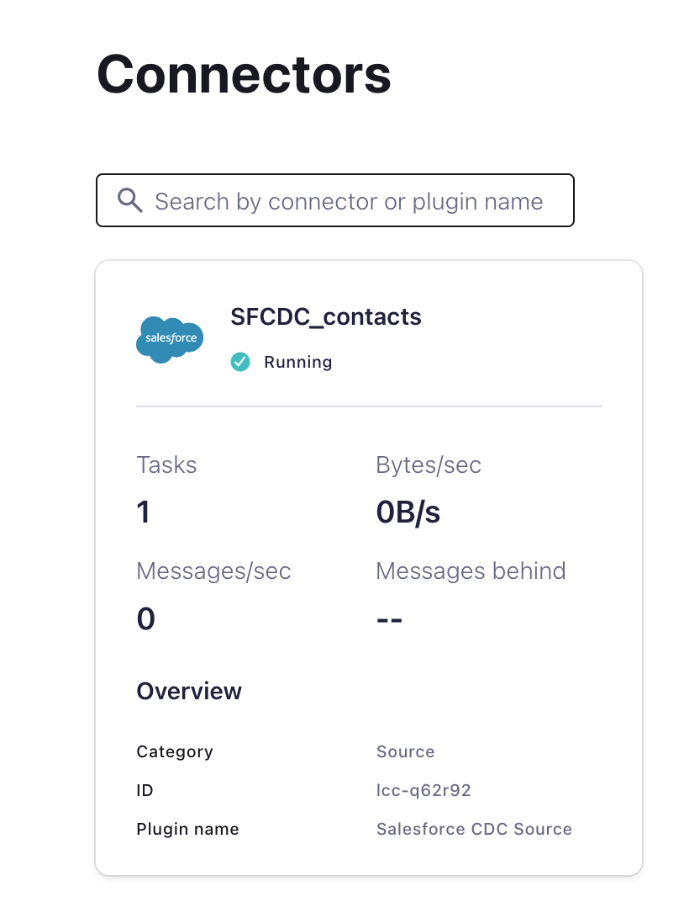
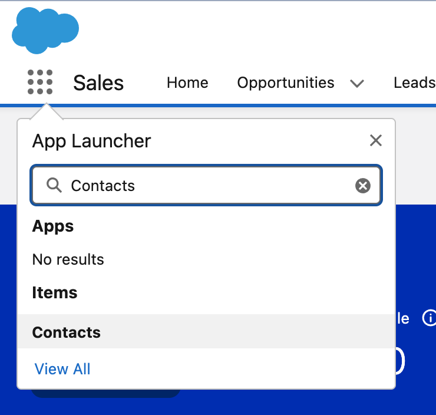
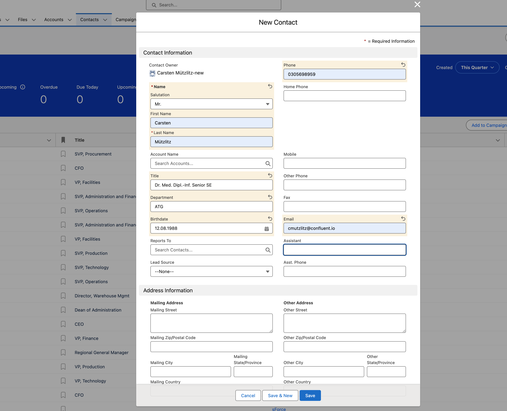
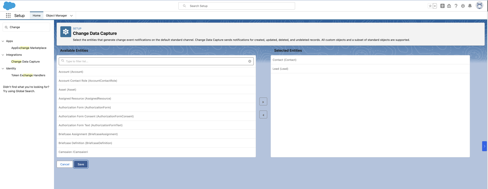
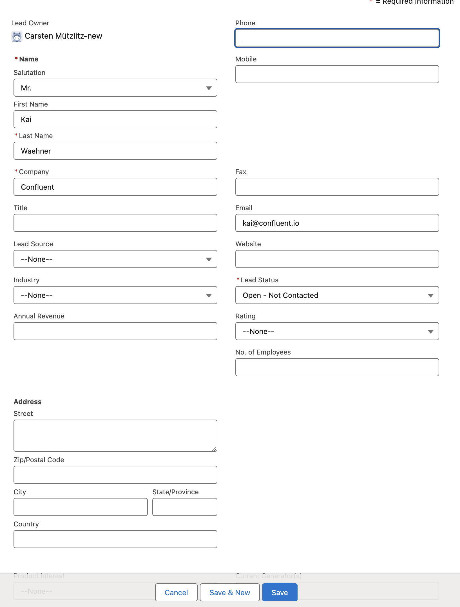
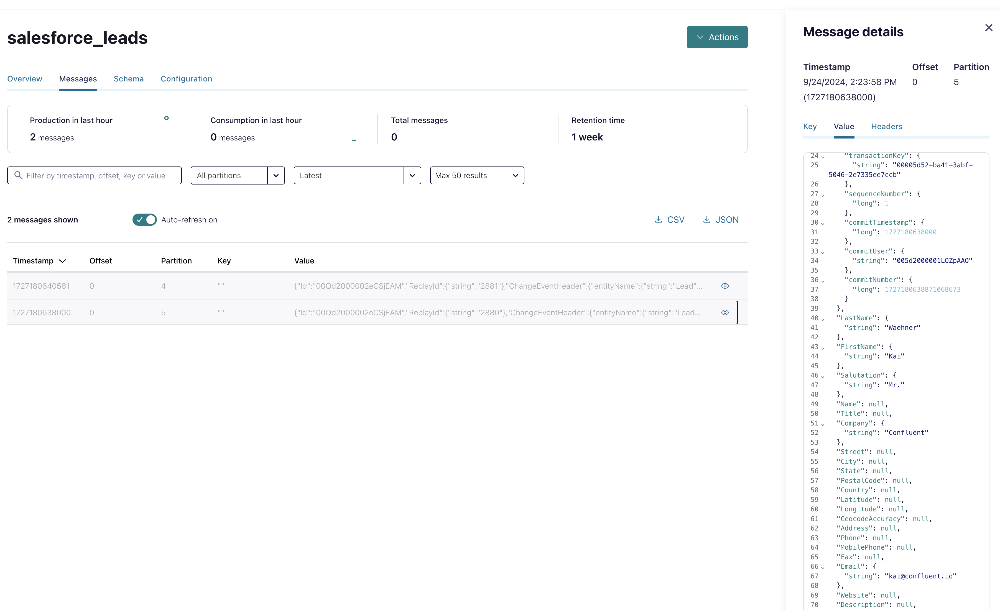

# Deploy Salesforce CDC Source connector

It is expected that you did the [preparation in Salesforce](setup_salesforce.md).
Before Deployment please login into Salesforce with your credentials you saved in `terraform/aws/.accounts`. Go to [Salesforce-Development](https://login.salesforce.com)) or use you own Salesforce-Sandbox. Please let the Salesforce App open, we add a contact later.
If you did login successfully, then please do the deployment:

Before deploy the first connector before consider if you would like to run a second Salesforce CDC Connector for CDC LeadChangeEvent. If you would do it, then copy the complete now:

```bash
cd ..
cp -R ccloud-source-salesforce-cdc-connector/  ccloud-source-salesforce-cdc-connector2/
```

Now, deploy the first Salesforce CDC Connector.

```bash
# Deploy connector
cd ../ccloud-source-salesforce-cdc-connector
# or
cd ccloud-source-salesforce-cdc-connector
source .ccloud_env
terraform init
terraform plan
terraform apply
```

Terraform will output after a successful deployment:

```bash
# Apply complete! Resources: 1 added, 0 changed, 0 destroyed.
# Outputs:
# A00_SALES_CDC_Connector = "Login into your Confluent Cloud Console and check in your cluster if Salesforce CDC Source Connector is running"
```



Terraform need a while to close. But the connector is working already.
The connector is using the deployed topic `salesforce_contacts`. This was created via `ccloud_cluster` deployment including the schema.

Try to insert a new Contact record via the Salesforce UI. [Login](https://login.salesforce.com/) and click on the left upper **App Launcher icon** and search for **Contacts**


Click on **New** (upper right corner) and create a new Contact. And click **save**.


Try to find this record in Confluent Cloud console topic viewer.


Salesforce CDC is working. So, we are finished with this lab.
With this last Source Connector we should now have all CDC Source Connectors running.


## (optional) Run a second Salesforce CDC connector

First check, if you did setup a CDC-Lead-Event. If it is set, continue, if not select it and save.


Follow these steps for a second Salesforce connector:

```Bash
cd ../ccloud-source-salesforce-cdc-connector2/
# First create topic
confluent kafka topic create salesforce_leads --cluster $TF_VAR_clusterid --environment $TF_VAR_envid
# Change properties
# Topic name salesforce_contacts to salesforce_leads
sed -i '' -e 's/salesforce_contacts/salesforce_leads/g' cflt_connectors.tf
# Change Connector Name
sed -i '' -e 's/SFCDC_contacts/SFCDC_Leads/g' cflt_connectors.tf
# show results
cat cflt_connectors.tf
# Run terraform
source .ccloud_env
# CDC name via var.sf_cdc_name, so overwrite this variable
export TF_VAR_sf_cdc_name="LeadChangeEvent"
terraform init
terraform plan
terraform apply
```

> [!TIP]
> Now, we have 2 Salesforce CDC Connectors. It is best practice to run 1 Task Connectors for each Event-Object.

Please enter a new Lead.


Check the change Topic:


> [!IMPORTANT]
> Do not forget to destroy the second Salesforce Connector. It will not destroy with [../00_shutdown_services.sh](../00_shutdown_services.sh). To destroy the connector execute `terraform destroy`

back to [Deployment-Steps Overview](../README.md) or continue with [data processing](../dataprocessingREADME.md)