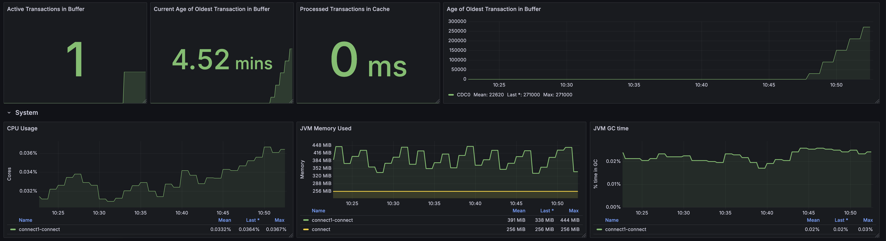
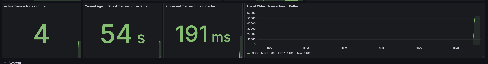
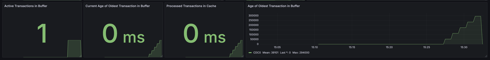

# Long running Transaction testcase with Oracle DB

According to Confluent documentation for [long running transactions](https://docs.confluent.io/kafka-connectors/oracle-cdc/current/overview.html#handling-long-running-transactions) we can summarize the following:
For managing long-running transactions in Confluent’s CDC Connector for Oracle, key points include:
* **Impact on Performance**: Long-running transactions increase memory usage and can lead to out-of-memory errors, slowing down change data capture.
* **Impact on Storage**: Uncommitted long running connection will be buffered into a Memory Buffer in Connnector till transaction is committed (Default). 
* **Recommendation**: Confluent advises avoiding long-running transactions to prevent scalability issues and potential deadlocks.
* **Alternative Measures**: If modifying applications isn’t feasible, use `log.mining.transaction.age.threshold.ms` to set an age threshold for transactions. When exceeded, `log.mining.transaction.threshold.breached.action` determines whether to retain or drop these transactions (use cautiously to avoid data loss).
* **Availability**: This feature is supported from Connector version 2.10.0 for Oracle 19c and later.

So, we do have 3 main properties for the connector to deal with long running transaction. You have to know that the connector will buffer all uncommited changed in the connector heap memory so-called buffer.

```bash
# Default waiting till commit
use.transaction.begin.for.mining.session=False        # False is default
log.mining.transaction.age.threshold.ms=-1            # Default is -1, meaning until commit, we did 5 minutes
log.mining.transaction.threshold.breached.action=Warn # is default
# Versus discard transaction from buffer after 5 minutes wait
use.transaction.begin.for.mining.session=True         # False is default
log.mining.transaction.age.threshold.ms=300000        # we did wait for 5 minutes till commit
log.mining.transaction.threshold.breached.action=discard # is must, for dropping transaction after threshold
```

First we will do some investigation in our database.

## Pre-requisites

* Confluent Cloud cluster must run, see [Start Confluent Cloud Cluster](../ccloud-cluster/README.md)
* The Oracle Database must run, see  [Start Oracle DB Instance](README.md)

What is the problem with long running transactions, see [what Ask Tom answered](https://asktom.oracle.com/ords/asktom.search?tag=long-transactions). For the Confluent CDC Connector in general it is the buffering of uncommitted changes, which can lead to Out of Memory issues. So, before executing the Confluent CDC Connector be pretty sure, that long running transactions is almost not visible in your DB, this will make everything much more easier.

## Test Case: prepare long running transactions.

We do have the following situation with our DB here in this workshop, right now after deployment:
* No sessions
* No transactions
* prepared for CDC with Confluent
* it is a clean database

Let's prove this. Use the [Google Cloud Console for Compute Engine](https://console.cloud.google.com/compute/instances) and click SSH to login into Compute service of DB:

Terminal 1:
```SQL
# Login into Oracle Docker
sudo docker exec -it oracle21c /bin/bash
# Connect as sysdba
sqlplus sys/confluent123@XEPDB1 as sysdba
# Show sessions
SQL> set line 300
SQL> column username format a30
SQL> column program format a50
SQL> column sstatus format a8
SQL> column tstatus format a8
SQL> column sql_text format a70
SQL> column Objekt format a11
SQL> select username, 
            program, 
            status 
     from v$session 
    where TYPE='USER';
# You should see the one sqlplus session we are workiing in
# USERNAME                       PROGRAM                                            STATUS
# ------------------------------ -------------------------------------------------- --------
# SYS                            sqlplus@a323728a99af (TNS V1-V3)                   ACTIVE

# Check for long running transactions or lets say for Transactions still running (without commit)
SQL> select s.username, 
       s.program, 
       s.status as sstatus, 
       t.status as tstatus,
       t.START_SCN, 
       t.START_TIME, 
       o.sql_text
  from v$session s, v$transaction t, v$open_cursor o 
 where s.taddr = t.addr
   and t.status='ACTIVE'
   and o.sql_id = s.prev_sql_id;
# no rows selected
```

So, the workshop DB is very pretty well prepared, no open transaction and no sessions. But in reality this looks different.

> [!NOTE]
> Table Reference for [v$transaction](https://docs.oracle.com/en/database/oracle/oracle-database/21/refrn/V-TRANSACTION.html) and for [v$session](https://docs.oracle.com/en/database/oracle/oracle-database/19/refrn/V-SESSION.html), and table reference for [v$open_cursor](https://docs.oracle.com/en/database/oracle/oracle-database/21/refrn/V-OPEN_CURSOR.html) and for [v$lock](https://docs.oracle.com/en/database/oracle/oracle-database/19/refrn/V-LOCK.html).

We are correct, there are no transactions open. Let's see the difference in a different terminal and execute an uncommitted transaction:
Use the [Google Cloud Console for Compute Engine](https://console.cloud.google.com/compute/instances) and click SSH to login into Compute service of DB:
Terminal 2:

```SQL
# Login into Oracle Docker
sudo docker exec -it oracle21c /bin/bash
# Connect as Application owner
sqlplus ordermgmt/kafka@XEPDB1
SQL> 
begin
   update inventories set quantity=quantity-1 where product_id=207 and warehouse_id=8;
end;
/
# PL/SQL procedure successfully completed.
# And we do not commit here
```

We do have an uncommited transaction, go back to Terminal 1 and execute the last query by hitting `/` and enter or copy/past the following statement again.

```SQL
SQL> select s.username, 
       s.program, 
       s.status as sstatus, 
       t.status as tstatus,
       t.START_SCN, 
       t.START_TIME, 
       o.sql_text
  from v$session s, v$transaction t, v$open_cursor o 
 where s.taddr = t.addr
   and t.status='ACTIVE'
   and o.sql_id = s.prev_sql_id;
# USERNAME                       PROGRAM                                            SSTATUS  TSTATUS   START_SCN START_TIME         SQL_TEXT
# ------------------------------ -------------------------------------------------- -------- -------- ---------- -------------------- ----------------------------------------------------------------------
# ORDERMGMT                      sqlplus@1b9c9b0ec749 (TNS V1-V3)                   INACTIVE ACTIVE      3632361 11/12/24 08:25:46    begin    update inventories set quantity=quantity-1 where pr   
```

We do see the not commited transaction and a start_scn=3632361 for our update transaction.
Now, please open 3 More terminals and executing three other transaction with the same statement.
Use the [Google Cloud Console for Compute Engine](https://console.cloud.google.com/compute/instances) and click SSH to login into Compute service of DB:
Terminal 3:

```SQL
# Login into Oracle Docer
sudo docker exec -it oracle21c /bin/bash
# Connect as Application owner
sqlplus ordermgmt/kafka@XEPDB1
SQL> 
begin
   update inventories set quantity=quantity-1 where product_id=207 and warehouse_id=8;
end;
/
# You see no PL/SQL procedure successfully completed.
```

This transaction command did not end. You do not see any `PL/SQL procedure successfully completed`. This means we do have a blocking. The first command must finish and then second command can finish.
Do the same again in another Terminal. Use the [Google Cloud Console for Compute Engine](https://console.cloud.google.com/compute/instances) and click SSH to login into Compute service of DB:
Terminal 4:

```SQL
# Login into Oracle Docer
sudo docker exec -it oracle21c /bin/bash
# Connect as Application owner
sqlplus ordermgmt/kafka@XEPDB1
SQL> 
begin
   update inventories set quantity=quantity-1 where product_id=207 and warehouse_id=8;
end;
/
# You see no PL/SQL procedure successfully completed.
```

Same situation here with Terminal 4.

Now, we have the special situation where terminal 3-4 is waiting for Terminal 2. Check the Status of transaction right now:

```SQL
SQL> select s.username, 
       s.program, 
       s.status as sstatus, 
       t.status as tstatus,
       t.START_SCN, 
       t.START_TIME, 
       o.sql_text
  from v$session s, v$transaction t, v$open_cursor o 
 where s.taddr = t.addr
   and t.status='ACTIVE'
   and o.sql_id = s.prev_sql_id;
# USERNAME      PROGRAM                           SSTATUS  TSTATUS   START_SCN START_TIME         SQL_TEXT
# ------------- --------------------------------- -------- -------- ---------- ------------------ ----------------------------------------------------------------------
# ORDERMGMT     sqlplus@1b9c9b0ec749 (TNS V1-V3)  INACTIVE ACTIVE    3632361   11/12/24 08:25:46  begin    update inventories set quantity=quantity-1 where pr
# ORDERMGMT     sqlplus@1b9c9b0ec749 (TNS V1-V3)  INACTIVE ACTIVE    3632361   11/12/24 08:25:46  begin    update inventories set quantity=quantity-1 where pr
# ORDERMGMT     sqlplus@1b9c9b0ec749 (TNS V1-V3)  INACTIVE ACTIVE    3632361   11/12/24 08:25:46  begin    update inventories set quantity=quantity-1 where pr   
```

Your monitoring Dashboard [see migrateConnectors](../ccloud-source-oracle-cdc-connector/migrateConnectors/README.md) will show the buffer is acting right now. We have Transaction in buffer, the other are blocked and waiting to be executed.


We have our 3 running transactions visible in `v$transaction`. But here is a main difference. If you execute the next SQL-statement you will see:

```SQL

SQL> select 
   lo.session_id, s.serial#, s.username, s.program,  
   o.object_name as Objekt, l.block as blocking_others, l.request, l.TYPE, l.ctime as time_in_sec  
from 
   v$locked_object lo, all_objects o, v$session s, v$lock l 
where 
   lo.object_id = o.object_id 
   and lo.session_id =  s.sid
   and lo.session_id = l.sid
order by 
   lo.session_id;
# SESSION_ID    SERIAL# USERNAME    PROGRAM                          OBJEKT      BLOCKING_OTHERS    REQUEST TYPE TIME_IN_SEC
# ---------- ---------- ----------- -------------------------------- ----------- --------------- ---------- ---- -----------
#        379      41288 ORDERMGMT   sqlplus@1b9c9b0ec749 (TNS V1-V3) INVENTORIES               0          0 TM         584
#        379      41288 ORDERMGMT   sqlplus@1b9c9b0ec749 (TNS V1-V3) INVENTORIES               0          0 AE         595
#        379      41288 ORDERMGMT   sqlplus@1b9c9b0ec749 (TNS V1-V3) INVENTORIES               1          0 TX         584
#        391       2532 ORDERMGMT   sqlplus@1b9c9b0ec749 (TNS V1-V3) INVENTORIES               0          0 AE         397
#        391       2532 ORDERMGMT   sqlplus@1b9c9b0ec749 (TNS V1-V3) INVENTORIES               0          0 TM         387
#        391       2532 ORDERMGMT   sqlplus@1b9c9b0ec749 (TNS V1-V3) INVENTORIES               0          6 TX         387
#        400       8368 ORDERMGMT   sqlplus@1b9c9b0ec749 (TNS V1-V3) INVENTORIES               0          0 AE         251
#        400       8368 ORDERMGMT   sqlplus@1b9c9b0ec749 (TNS V1-V3) INVENTORIES               0          0 TM         239
#        400       8368 ORDERMGMT   sqlplus@1b9c9b0ec749 (TNS V1-V3) INVENTORIES               0          6 TX         239
#  9 rows selected.
``` 

We do we see 9 rows and having only 3 transactions waiting:
* TM = A use User DML Lock: Synchronizes accesses to an object
* AE = Editoin Lock from the System: Prevent Dropping an edition in use
* TX = A user Transaction: Lock held by a transaction to allow other transactions to wait for it

The first transaction (TX) is blocking and the other transaction with Request=6 show an exclusive Lock Mode. This means: When a statement modifies data, its transaction holds an exclusive lock on data that prevents other transactions from accessing the data. This lock remains in place until the transaction holding the lock issues a commit or rollback. Table-level locking lowers concurrency in a multi-user system.

I hope this now pretty clear. **Why I show this?**
The reason is your database can be in situation where you have lots of long running transactions which blocks others (like our example). This could lead to OOM issues in the connector buffer.

Please start the Oracle CDC Connector with Standard Parameters see [Oracle CDC Connector](../ccloud-source-oracle-cdc-connector/README.md) now.
After the connector is starting check again the session:

```SQL
# we are still sysdba acting in XEPDB1
SQL> select s.username, 
       s.program, 
       s.status as sstatus, 
       t.status as tstatus,
       t.START_SCN, 
       t.START_TIME, 
       o.sql_text
  from v$session s, v$transaction t, v$open_cursor o 
 where s.taddr = t.addr
   and t.status='ACTIVE'
   and o.sql_id = s.prev_sql_id;
```   

We do have the same transactions running and 

run order generator:

```SQL
# we are still sysdba acting in XEPDB1
SQL> connect ordermgmt/kafka@XEPDB1
SQL> @/opt/oracle/scripts/setup/06_data_generator.sql
SQL> 
begin
   produce_orders;
end;
/
```   

Check sessions for the connector in a new terminal, your will see the logminer session and selects to v$logmnr_contents view:
Use the [Google Cloud Console for Compute Engine](https://console.cloud.google.com/compute/instances) and click SSH to login into Compute service of DB:

```SQL
sudo docker exec -it oracle21c /bin/bash
# Switch to CDB as sysdba
sqlplus sys/confluent123@XE as sysdba
# Show session of connnector user
SQL> set line 300
SQL> column username format a15
SQL> column program format a20
SQL> column status format a8
SQL> select s.username, 
       s.program, 
       s.status as sessionstatus, 
       t.sql_text
  from v$session s,  v$open_cursor o,  v$sqltext t
 where s.username='C##MYUSER' 
   and o.sql_id = s.prev_sql_id
   and o.hash_value = t.hash_value
   AND o.address = t.address;
# Run again, the sessions change very fast
SQL> r
```   

What is achieved so far is:

* orders are generated
* updates on inventories are not committed and therefore not visible in table topic `XEPDB1.ORDERMGMT.INVENTORIES`
* Connector is throwing no errors and no warnings

The connector would now wait till someone committed to open transactions. Please stop the terraform connector now:

```bash
cd gcp/ccloud-source-oracle-cdc-connector
source .ccloud_env
terraform destroy

# Change the properties to in cflt_connectors.tf
    "use.transaction.begin.for.mining.session" = "true"
    "log.mining.transaction.age.threshold.ms"  = "300000" # 5 minutes
    "log.mining.transaction.threshold.breached.action" = "discard"

# and start connector again, we do not care about offsets and duplicates right now
terraform apply 
``` 

We still have our transactiions open and the connector is running with dropping all long running transaction from buffer.
> [!IMPORTANT]
> DISCARD setting in Connector does not mean that the DB transaction will be killed in DB. It will dropped from buffer in connector and not produced to kafka if Threshold > 5 minutes.

Use the [Google Cloud Console for Compute Engine](https://console.cloud.google.com/compute/instances) and click SSH to login into Compute service of DB:
Have a look into DB:

```SQL
# Login into Oracle Docer
sudo docker exec -it oracle21c /bin/bash
# Connect as sysdba
sqlplus sys/confluent123@XEPDB1 as sysdba
# Show sessions
SQL> set line 300
SQL> column username format a30
SQL> column program format a50
SQL> column sstatus format a8
SQL> column tstatus format a8
SQL> column sql_text format a70
SQL> column Objekt format a11
SQL> select username, 
            program, 
            status 
     from v$session 
    where TYPE='USER';
# You should see the one sqlplus session we are working and our three transactions and the data generator
# USERNAME                       PROGRAM                                            STATUS
# ------------------------------ -------------------------------------------------- --------
# SYS                            sqlplus@1b9c9b0ec749 (TNS V1-V3)                   ACTIVE
# ORDERMGMT                      sqlplus@1b9c9b0ec749 (TNS V1-V3)                   ACTIVE
# ORDERMGMT                      sqlplus@1b9c9b0ec749 (TNS V1-V3)                   INACTIVE
# ORDERMGMT                      sqlplus@1b9c9b0ec749 (TNS V1-V3)                   ACTIVE
# ORDERMGMT                      sqlplus@1b9c9b0ec749 (TNS V1-V3)                   ACTIVE

# Check for long running transactions or lets say for Transactions still running (without commit)
SQL> select s.username, 
       s.program, 
       s.status as sstatus, 
       t.status as tstatus,
       t.START_SCN, 
       t.START_TIME, 
       o.sql_text
  from v$session s, v$transaction t, v$open_cursor o 
 where s.taddr = t.addr
   and t.status='ACTIVE'
   and o.sql_id = s.prev_sql_id;
# USERNAME                       PROGRAM                            SSTATUS  TSTATUS   START_SCN START_TIME           SQL_TEXT
# ------------------------------ ---------------------------------- -------- -------- ---------- -------------------- ----------------------------------------------------------------------
# ORDERMGMT                      sqlplus@1b9c9b0ec749 (TNS V1-V3)   INACTIVE ACTIVE      3632361 11/12/24 08:25:46    begin    update inventories set quantity=quantity-1 where pr
# ORDERMGMT                      sqlplus@1b9c9b0ec749 (TNS V1-V3)   INACTIVE ACTIVE      3632361 11/12/24 08:25:46    begin    update inventories set quantity=quantity-1 where pr
# ORDERMGMT                      sqlplus@1b9c9b0ec749 (TNS V1-V3)   INACTIVE ACTIVE      3632361 11/12/24 08:25:46    begin    update inventories set quantity=quantity-1 where pr
# our transactions are still not commited
# Switch to CDB as sysdba
SQL> connect sys/confluent123@XE as sysdba
# Show session of connnector user
SQL> select 
       s.username, 
       s.program, 
       s.status as sstatus, 
       t.sql_text
  from v$session s,  v$open_cursor o,  v$sqltext t
 where s.username='C##MYUSER' 
   and o.sql_id = s.prev_sql_id
   and o.hash_value = t.hash_value
   AND o.address = t.address;
# USERNAME                       PROGRAM                                            SSTATUS  SQL_TEXT
# ------------------------------ -------------------------------------------------- -------- ----------------------------------------------------------------------
# C##MYUSER                      JDBC Thin Client                                   INACTIVE SELECT SYSTIMESTAMP FROM DUAL
# C##MYUSER                      JDBC Thin Client                                   INACTIVE SELECT SYSTIMESTAMP FROM DUAL
# C##MYUSER                      JDBC Thin Client                                   INACTIVE BLESPACE_NAME IS NULL) AND NESTED = 'NO'
# C##MYUSER                      JDBC Thin Client                                   INACTIVE AND (TABLESPACE_NAME NOT IN ('SYSAUX', 'UNDOTBS1', 'TEMP') OR TA
# C##MYUSER                      JDBC Thin Client                                   INACTIVE  p.PDB_ID > 2 AND p.PDB_ID = c.CON_ID AND p.PDB_NAME = 'XEPDB1'
# C##MYUSER                      JDBC Thin Client                                   INACTIVE SELECT c.TABLE_NAME, c.OWNER FROM DBA_PDBS p, CDB_TABLES c WHERE
```

Check status of connector

```bash
confluent login
confluent connect cluster list --environment $TF_VAR_envid --cluster $TF_VAR_clusterid 
# get the id
confluent connect cluster describe lcc-XCXXXX  --environment $TF_VAR_envid --cluster $TF_VAR_clusterid 
# try to get the log
confluent connect event describe -o yaml 
# Add the parameters
confluent environment use env-XXXXX
confluent kafka cluster use lkc-XXXX
# use you created audit log API KEy
confluent api-key use APIKEY
confluent kafka topic consume -b confluent-connect-log-events
# Starting Kafka Consumer. Use Ctrl-C to exit.
# {"datacontenttype":"application/json","data":{"level":"ERROR","context":{"connectorId":"lcc-26o98y"},"summary":{"connectorErrorSummary":{"message":"Error while polling for records","rootCause":"Failed to subscribe 
# to the redo log topic \u0027XEPDB1.ORDERMGMT.REDOLOG\u0027 even after waiting 300 seconds. V...
```

In my case I see only one error, which is not a problem. So, it seems to running pretty well.

If I do now commit the first open transactions, then nothing happen in redolog topic (XEPDB1.ORDERMGMT.REDOLOG) and table topic (XEPDB1.ORDERMGMT.INVENTORIES).
Remember we did configure connector as followed:

```bash
use.transaction.begin.for.mining.session=True         # False is default
log.mining.transaction.age.threshold.ms=300000        # we did wait for 5 minutes till commit
log.mining.transaction.threshold.breached.action=Discard # is dropping
```

Please commit the first transaction now.
* my last offset in XEPDB1.ORDERMGMT.INVENTORIES is 2223
* my last offset in XEPDB1.ORDERMGMT.REDOLOG is 502

What is happened after commit:
* We do see no entries for inventories topic and redolog topic (for inventories)
* and the second Transaction the blocked one, was executed. Form now on, the connector is counting the time for long running transaction for the second transaction, the third one is still blocked.
* Please commit the second transaction now, before the 5 minute threshold ends.
      - The third transaction became unblocked and executed
      - the second transaction was produced into redo and table topic because we do not reach the threshold of 5 minutes.
      - If you now wait 5 minutes for the commit of the third transaction, then this transaction will be dropped from connector buffer and never produced-

**(optional)**: A last demonstration is run a pl/sql without commit, so we are doing inserts and do not commit and see what the monitor will tell us. For this sample I use the [migration Connector setup with a self-managed CDC Connector](../ccloud-source-oracle-cdc-connector/migrateConnectors/README.md). I change the setting to discard after 5 mins and will create 600 inserts in 10 minutes in one transaction. I run 3 Transaction in parallel. We will see how the buffer of the connector is progress.

Start the self-managed connector:

```bash 
cd ccloud-source-oracle-cdc-connector/migrateConnectors
source .env
cp cdc_ccloud.json.template cdc_ccloud.json 
# replace placeholder in cdc_ccloud.json with values from cat .env
# change values for long transactions 
              "use.transaction.begin.for.mining.session":         "true",
              "log.mining.transaction.age.threshold.ms":          "300000",
              "log.mining.transaction.threshold.breached.action": "discard",
# Start the connect docker with monitoring
docker-compose -f docker-compose-cdc-ccloud_new.yml up -d
# Start the connector
# Are connectors running?
curl -s -X GET -H 'Content-Type: application/json' http://localhost:8083/connectors | jq
# start connector with correct json config
curl -s -X POST -H 'Content-Type: application/json' --data @cdc_ccloud.json http://localhost:8083/connectors | jq
# Check status
curl -s -X GET -H 'Content-Type: application/json' http://localhost:8083/connectors/CDC0/status | jq
# If connector is running, do not delete, only if it fails, then delete and fix the error and start again
# curl -s -X DELETE -H 'Content-Type: application/json' http://localhost:8083/connectors/CDC0 | jq
```

run order generator with out commit (Terminal 1): Use the [Google Cloud Console for Compute Engine](https://console.cloud.google.com/compute/instances) and click SSH to login into Compute service of DB:

```bash
sudo docker exec -it oracle21c /bin/bash
# we are still sysdba acting in XEPDB1
sqlplus ordermgmt/kafka@XEPDB1
-- If you do not execute install the procedures 
SQL> @/opt/oracle/scripts/setup/06_data_generator.sql
SQL> 
begin
   produce_orders_wo_commit;
end;
/
```  

open a second terminal 2: Use the [Google Cloud Console for Compute Engine](https://console.cloud.google.com/compute/instances) and click SSH to login into Compute service of DB:

```bash
sudo docker exec -it oracle21c /bin/bash
# we are still sysdba acting in XEPDB1
sqlplus ordermgmt/kafka@XEPDB1
-- If you do not execute install the procedures 
SQL> @/opt/oracle/scripts/setup/06_data_generator.sql
SQL> 
begin
   produce_orders_wo_commit;
end;
/
```  

open a third terminal 3: Use the [Google Cloud Console for Compute Engine](https://console.cloud.google.com/compute/instances) and click SSH to login into Compute service of DB:

```bash
sudo docker exec -it oracle21c /bin/bash
# we are still sysdba acting in XEPDB1
sqlplus ordermgmt/kafka@XEPDB1
-- If you do not execute install the procedures 
SQL> @/opt/oracle/scripts/setup/06_data_generator.sql
SQL> 
begin
   produce_orders_wo_commit;
end;
/
```

Before checking the Grafana Dashboard, please have a look in your database. How many transactions are still running?
Use the [Google Cloud Console for Compute Engine](https://console.cloud.google.com/compute/instances) and click SSH to login into Compute service of DB:

```SQL
# Login into Oracle Docker
sudo docker exec -it oracle21c /bin/bash
# Connect as sysdba
sqlplus sys/confluent123@XEPDB1 as sysdba
SQL> select s.username, 
       s.program, 
       s.status as sstatus, 
       t.status as tstatus,
       t.START_SCN, 
       t.START_TIME, 
       o.sql_text
  from v$session s, v$transaction t, v$open_cursor o 
 where s.taddr = t.addr
   and t.status='ACTIVE'
   and o.sql_id = s.prev_sql_id;
```

You are right 3 transactions. (we 4 in the image, not sure where the forth one is coming from)
And now please check [Grafana CDC Dashboard](http://localhost:3000)
You will see the buffer. If you do nothing the buffer is clean after 5 minutes.
We do see 4 transaction in total in our connector buffer.


And surprise surprise all transaction are dropped from buffer after 5 min.


If you ready **stop self-managed setup**:

```Bash
# delete connector
curl -s -X DELETE -H 'Content-Type: application/json' http://localhost:8083/connectors/CDC0 | jq
# delete connnect docker
docker-compose -f docker-compose-cdc-ccloud_new.yml down -v
```

I hope this simple example show the complexity of transaction handling in the DB. 

If you will execute more details in the DB, please follow [Oracle Analysis Queries](OracleAnalysisQueries.md)

back to [Deployment-Steps Overview](../README.md) or continue with the [Oracle CDC Connector](../ccloud-source-oracle-cdc-connector/README.md)